==========================================
アプリケーションの画面概要
==========================================

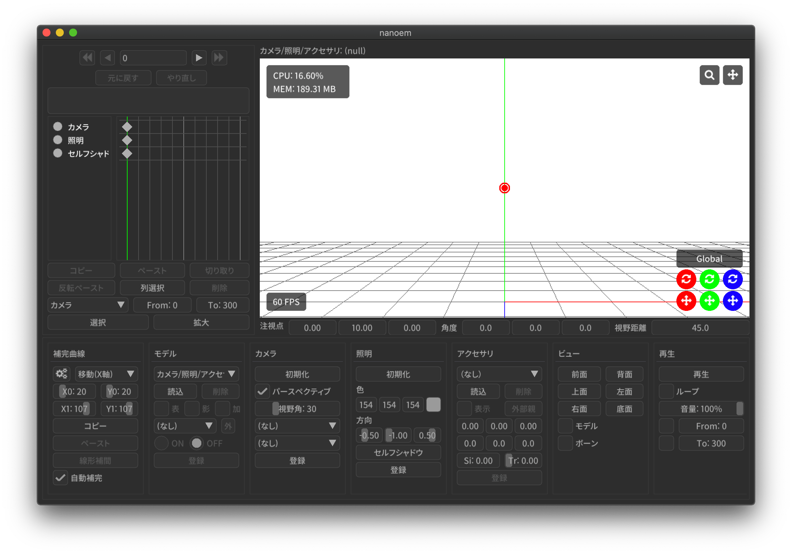

大まかには以下の３つに大別されます。

- :ref:`721C4B9C-55DD-46BD-A506-DA412489831E`

  - モデルやアクセサリなどを動かす要素であるモーションのキーフレームを可視化したもの
  - Blender や Unity その他 3DCG アプリケーションでいうところのドープシートに近い

- :ref:`D00A9E0D-8AE1-4E1A-A8BC-C85CBAE1C537`

  - モデルやアクセサリを表示する領域
  - MikuMikuDance ではプレビュー画面と呼ばれている

- パネル

  - モデルやアクセサリその他を操作する領域

.. tip::
   - 入力欄によっては左右にドラッグすることによって数値変化するものがあります
   - スライダーはシフトを押しながらクリックすると数値入力することができます

.. _721C4B9C-55DD-46BD-A506-DA412489831E:

タイムライン
******************************************

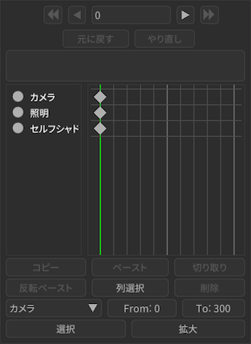

（リサイズ）
==========================================

.. note::
   この機能は 26.4 から導入されました

タイムラインと :ref:`D00A9E0D-8AE1-4E1A-A8BC-C85CBAE1C537` の間にカーソルを当てると緑色のバーが表示されます。
これをドラッグするとタイムラインのリサイズができ、 :ref:`D00A9E0D-8AE1-4E1A-A8BC-C85CBAE1C537` もタイムラインにあわせて拡大縮小されます。

初期値はタイムラインと :ref:`D00A9E0D-8AE1-4E1A-A8BC-C85CBAE1C537` の割合が 30:70 になるように調整され、 25:75 から 75:25 の間で調整可能です。
30:70 に近い割合でリサイズが行われようとした場合自動的に 30:70 になるように自動的にリサイズ（スナップ）されます。

.. caution::
   - 既知の問題として何回もリサイズが行われた場合 :ref:`D00A9E0D-8AE1-4E1A-A8BC-C85CBAE1C537` が徐々に小さくなる問題があります

    - その場合は「ビューポート設定ダイアログ」から一度解像度の値を変更してもとに戻してください
    - ウィンドウを拡大縮小しても効果はないため上記手段で対処をお願いします

   - スナップを切る機能はありません

（フレーム移動）
==========================================

現在のフレーム位置を移動します

.. important::
  - 「フレーム」は「キーフレーム」とは別です！

    - 具体的にいうとキーフレームはタイムライン上に🔶のマークが表示されてます
    - 選択されたキーフレームは🔶のマークの色がオレンジ色になります

- 右方向のボタンをクリックすると前のフレームに移動します

  - 例えば現在のフレーム位置が 123 の場合押すと 124 に移動する

- ⏩二重右方向のボタンをクリックすると前方向のキーフレームが存在するフレームに移動します

  - 例えば現在のフレーム位置が 123 で次のキーフレームが 115 にある場合は 115 に移動します
  - 主にカメラモーションのキーフレーム移動で利用します

- 左方向のボタンをクリックすると後ろのフレームに移動します

  - 例えば現在のフレーム位置が 123 の場合押すと 122 に移動する

- ⏪二重左方向のボタンをクリックすると後ろ方向のキーフレームが存在するフレームに移動します

  - 例えば現在のフレーム位置が 123 で次のキーフレームが 130 にある場合は 130 に移動します

- ボタンは押し続けることが出来ます

  - 長押しすることで高速に移動することができます

- 数値入力が可能で、エンターキーを押すとその位置に移動します

（タイムライン内の範囲ドラッグ）
==========================================

- タイムライン内はドラッグすることができます

  - ドラッグ中はドラッグ開始位置から終了位置まで赤い四角で表示されます
  - 赤い四角の中に含まれたキーフレームは選択状態になります

（キーフレームのドラッグ）
==========================================

.. note::
   この機能は 25.0.0 から導入されました

- キーフレームを選択した状態でドラッグすると選択されたキーフレームを移動させることができます

  - フレーム位置が0番目にあるキーフレームはモーションの仕様により削除ではなく複製する形で移動します
  - 移動先にキーフレームが存在する場合は移動先に存在するキーフレームは削除される形で上書きされます

元に戻す
==========================================

:ref:`0AB17EB2-3D7A-4E91-82A4-B888C02415C8` と同じです

やり直し
==========================================

:ref:`E3DC7DFA-5EAB-4F58-88F0-151FBDC1008D` と同じです

（トラック）
==========================================

- モデルが選択されている場合は以下の順番で表示

  - 最初のボーン
  - モデル
  - 表情（モーフ）

    - カテゴリ分けされず全て表示される

  - ボーン

    - モデルでカテゴリ分けがされている場合それに基づいて表示

- モデルが選択されていない場合は以下の順番で表示

  - カメラ
  - 光源

.. _61D8222D-2A1D-4DC5-A960-0586D153F05A:

コピー
==========================================

選択されたキーフレームをコピーします。

- :ref:`A843137E-D975-47B7-86F1-E018BF189873` や :ref:`54B1F974-2B39-4472-B6F5-EAB40FDCC4F7` にあるコピーとは独立しているためそれらと共有することは出来ません

.. _FBD923A1-046B-4087-A094-D9D0F592F754:

ペースト
==========================================

「コピー」されたキーフレームを現在のフレーム位置に対してペーストします。

- :ref:`A843137E-D975-47B7-86F1-E018BF189873` や :ref:`54B1F974-2B39-4472-B6F5-EAB40FDCC4F7` にあるペーストとは独立しているためそれらと共有することは出来ません
- コピーされない限りボタンをおすことは出来ません

反転ペースト
==========================================

.. caution::
   同一モデルの左右の手足の動きをあわせるために使うものなので、たとえばふたつのモデルを使って鏡合わせ的な用途で利用することはできません

「コピー」されたキーフレームを現在のフレーム位置に対して反転ペーストします。

- 「反転ペースト」は以下の特性を除いて「ペースト」と同じです

  - ボーン名の先頭に「右」または「左」が含まれている場合、それらの値を「左」または「右」になるように値を調整する

- :ref:`A843137E-D975-47B7-86F1-E018BF189873` や :ref:`54B1F974-2B39-4472-B6F5-EAB40FDCC4F7` にあるペーストとは独立しているためそれらと共有することは出来ません
- コピーされない限りボタンをおすことは出来ません

.. _181F003D-42A0-4E7F-B92A-3143C39DFBC5:

列選択
==========================================

選択されているキーフレームを全てのトラック（列であるため）に登録されているキーフレームに対して選択します。

列選択はひとつ以上キーフレームを選択する必要があります。キーフレームがひとつも選択されていない場合は何も起こりません

削除
==========================================

.. note::
   キーフレームのうちフレーム位置が0のものは削除することが出来ません。削除しようとしてもフレーム位置が0のものは必ず残ります

選択されている全てのキーフレームを削除します。

開始
==========================================

キーフレームを選択するフレーム位置の開始位置を設定します。

「開始」は「選択」と「拡大」でのみ使われます。

終了
==========================================

キーフレームを選択するフレーム位置の終了位置を設定します。

「終了」は「選択」と「拡大」でのみ使われます。

（選択されたトラック）
==========================================

トラックを選択します

「選択されたトラック」は「選択」と「拡大」でのみ使われます。

.. _624222B5-6FD8-4565-855F-18B01543E52B:

選択
==========================================

上記の「開始」と「終了」の範囲内にあり、かつ「選択されたトラック」で指定されたキーフレームを全て選択します。

.. _0501EDF6-963F-43D4-A17A-40471A0F6D19:

拡大
==========================================

.. caution::
   カメラは隣接するキーフレームをシーン切り替えとして利用する仕様のため対応していません（MikuMikuDance でも同様の理由からできません）。かわりにカメラのキーフレームを手動でずらしてください

上記の「開始」と「終了」の範囲内にあるすべてのキーフレームのフレーム時間を 0.1-10 倍の単位で拡大または縮小します。

  * 拡大した場合は処理された箇所がスローモーションのように再生されます
  * 縮小した場合は処理された箇所が高速再生されます
  * 選択範囲より後ろにあるすべてのキーフレームは拡大または縮小するフレーム時間分を自動的に移動します

カメラ以外のモーションで適用可能です。モデルの場合は選択されたモデルに対して実行するため、全てのモデルに適用する場合はお手数ですがモデルを選択して拡大縮小を全てのモデルに対して繰り返し実行してください。

.. _D00A9E0D-8AE1-4E1A-A8BC-C85CBAE1C537:

ビューポート
******************************************

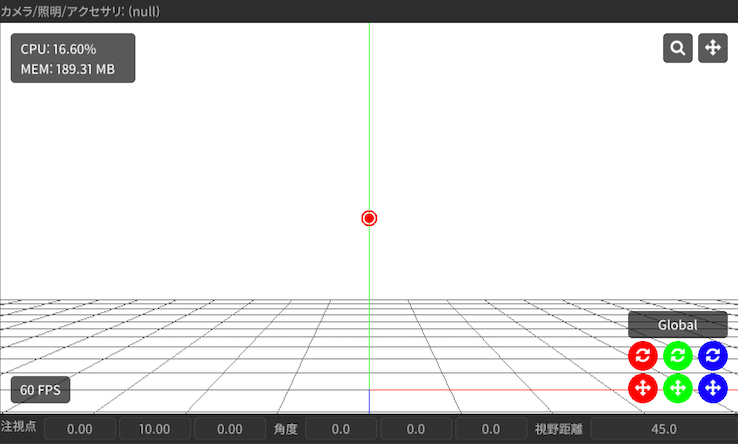

* 画面左上には選択されているモデル及びボーンの名前が表示されます

  * モデルが選択されていない場合は ``カメラ/照明/アクセサリ`` が表示されます
  * モデルのボーンが選択されていない場合は ``(null)`` が表示されます

* ``CPU`` は現在の nanoem の CPU 消費率を示します
* ``MEM`` は現在の nanoem のメモリ消費量を示します
* ``FPS`` は現在の秒間フレーム描画数を示します

  * 60FPS を維持できれば安定して描画できています

.. hint::

   * ``CPU`` と ``MEM`` の表示有無は :ref:`117B5B5A-2480-4C0E-A892-6D256866E8DC` で切り替えられます
   * ``FPS`` の表示有無は :ref:`6F169BE3-6F93-480B-9654-8BA501DF85FB` で切り替えられます

マウス操作
==========================================

.. important::
   MacBook Air または MacBook Pro のタッチパッド利用時のみ操作上の観点から右ボタンが **左ボタン** に切り替わります

:ref:`D00A9E0D-8AE1-4E1A-A8BC-C85CBAE1C537` においてマウス操作を行うことでカメラ操作またはモデル操作が可能です。ただし再生中は一切の操作を受け付けなくなりますので操作する場合は一回再生を停止させてください。

Undo/Redo ボタンは利用中のマウス（例えばロジクールの MX シリーズなど）に存在しかつ認識できる場合にのみ使えます。

カメラモードの場合
------------------------------------------

.. csv-table::

   右ボタンでドラッグ,カメラを回転
   中ボタンでドラッグ,カメラを移動
   左ボタン,:ref:`D00A9E0D-8AE1-4E1A-A8BC-C85CBAE1C537` のハンドルに反応するのみ
   Undo ボタンをクリック,巻き戻し
   Redo ボタンをクリック,やり直し

モデルが選択されている場合
------------------------------------------

.. csv-table::

   選択モード中に右ボタンでクリック,ボーンを選択
   箱選択時に右ボタンでドラッグ,ボーンを範囲選択
   回転モード中に右ボタンでドラッグ,選択されたボーンを回転
   移動モード中に右ボタンでドラッグ,選択されたボーンを移動
   中ボタンでドラッグ,カメラを移動 ※カメラモードとは独立
   左ボタン,:ref:`D00A9E0D-8AE1-4E1A-A8BC-C85CBAE1C537` のハンドルに反応するのみ
   Undo ボタンをクリック,巻き戻し
   Redo ボタンをクリック,やり直し

カメラのズーム
==========================================

:ref:`D00A9E0D-8AE1-4E1A-A8BC-C85CBAE1C537` 画面右上の虫眼鏡アイコンをドラッグするとカメラのズームを行うことが出来ます。

- 上方向にドラッグするとズームイン
- 下方向にドラッグするとズームアウト

SHIFT キーを押しながら操作するとカメラのかわりに背景動画のズームが可能になります。

カメラの注視点移動
==========================================

:ref:`D00A9E0D-8AE1-4E1A-A8BC-C85CBAE1C537` 画面右上の４方向矢印アイコンをドラッグするとカメラの注視点を移動させることが出来ます。

SHIFT キーを押しながら操作するとカメラのかわりに背景動画の位置移動が可能になります。

ハンドル
==========================================

モデルやカメラを動かすためのもので、 :ref:`D00A9E0D-8AE1-4E1A-A8BC-C85CBAE1C537` 画面右下にある６つの丸いボタンとその上にあるボタンで構成されています。

- ドラッグすることによりモデルまたはカメラを移動または回転させることが出来る

  - 赤が X 軸、緑が Y 軸、青が Z 軸をそれぞれ表す
  - ４方向矢印のアイコンが「移動」、２つの矢印が回るように表示されるアイコンが「回転」

- `Global` または `Local` と表示されている部分をクリックすると変形基準を変えることが出来る

  - `Global` は親に対する移動または回転に左右されない変形を行う
  - `Local` は特定のボーンに限り親の移動または回転を考慮した上で変形を行う

早い話実際に操作したほうが実感をつかめると思います

モード切替
==========================================

:ref:`D00A9E0D-8AE1-4E1A-A8BC-C85CBAE1C537` 画面左下にあるボタンで、カメラとモデルのそれぞれのモードを切り替えることが出来ます。

- モデルがすでにあり、かつモデルが選択されていない場合は「モデル」ボタン

  - 押すと最後に選択されたモデルが選択されてモデルモードに切り替わる

- モデルが選択されている場合は「カメラ」ボタン

  - 押すとカメラモードに切り替わる

数値入力
==========================================

:ref:`D00A9E0D-8AE1-4E1A-A8BC-C85CBAE1C537` 画面下に占めているもの

- カメラモードの場合は以下の項目を数値入力することが可能

  - 注視点
  - 角度
  - 視野距離

- モデルモードの場合は以下の項目を数値入力することが可能

  - 移動
  - 回転

- 入力中は入力された数値に基づいて暫定的に移動または回転が反映される
- いずれも数値入力後、入力前の値が「元に戻す」の操作に記録される
- X/Y/Z ボタンをクリックするとリセットすることが出来る

.. _A843137E-D975-47B7-86F1-E018BF189873:

補完曲線パネル 
******************************************

.. note::
   補間曲線パネルはキーフレームがボーンまたはカメラの場合のみ機能します

補完曲線はキーフレームとキーフレームの間の動きの変化を設定するものです。補完曲線のメリットとして

- １フレームずつパラメータを設定してキーフレーム登録するよりも遥かに効率的に動きをつけることが出来る

  - あとから動きを調整したい場面において補完曲線のパラメータをいじるだけで済む

    - 1フレームずつのキーフレーム登録だと影響する全てのキーフレームを修正する必要があり非常に手間がかかる

- キーフレームを減らすことが出来ることからモーションファイルを小さくすることが出来る

が挙げられます。ただし大きな動きの変化があるものは補完曲線では制御が難しくなるため明示的にパラメータを設定してキーフレーム登録する方が有利かもしれません。

補間曲線グラフパネル
==========================================

.. caution::
   - 表示するためのギアアイコンはキーフレームが一つ以上選択されていないと有効になりません
   - ボーンの場合、ボーンを選択しただけではボタンが無効のままなので注意が必要です

ギアアイコンをクリックすると選択された全てのボーンまたはカメラのキーフレームに対する補完曲線を描画したパネルが表示されます

- 選択されたキーフレームにそれぞれ異なる補完曲線が設定されている場合重ね合わせる形で描画されます

  - 「線形補間」の場合は名前が示すとおり左下から右上の斜め一直線が引かれます
  - X 軸が時間、Y 軸がキーフレームとキーフレームの間のパラメータの比率

    - X 軸は左が前のキーフレーム、右が次のキーフレーム
    - Y 軸は下が前のキーフレーム、上が次のキーフレーム

- ひとつもキーフレームが選択されていない場合は描画されません
- 1.19 から緑丸マークが表示され、今のフレーム位置が補間曲線上どこにいるか把握出来るようになっています

補間曲線を変更する
------------------------------------------

.. note::
   補間曲線はキーフレームがひとつだけ選択してる場合のみ変更することが出来ます

補間曲線は二箇所ある丸い点をドラッグすることにより変更することが出来ます。

- 変更対象がボーンの場合は「ボーン」パネルの「登録」ボタンを押して反映させる必要があります
- 変更対象がカメラの場合は「カメラ」パネルの「登録」ボタンを押して反映させる必要があります

（対象の選択）
==========================================

操作する補完曲線の対象を選択します

- カメラ

  - X 軸の注視点
  - Y 軸の注視点
  - Z 軸の注視点
  - 角度
  - 視野距離
  - 視野角

- モデル（ボーン）

  - X 軸の移動
  - Y 軸の移動
  - Z 軸の移動
  - 回転

コピー
==========================================

選択されたキーフレームの補完曲線をコピーします ※未実装

.. note::
   タイムラインや :ref:`54B1F974-2B39-4472-B6F5-EAB40FDCC4F7` にあるコピーとは独立しているためそれらと共有することは出来ません

ペースト
==========================================

「コピー」された補完曲線を現在選択されているキーフレームに対してペーストします

- ※未実装

  - 同名のもの、かつ「選択」で指定された対象に対してペーストする挙動になる予定

.. note::
   タイムラインや :ref:`54B1F974-2B39-4472-B6F5-EAB40FDCC4F7` にあるコピーとは独立しているためそれらと共有することは出来ません

線形補間
==========================================

現在選択されているキーフレームの補完曲線を全て線形補間に設定します

カメラパネル
******************************************

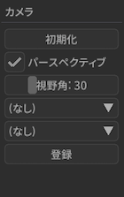

初期化
==========================================

:ref:`6CA8BA4B-E0D2-449E-A9C9-4FA445CEEAF5` と同じです

パースペクティブ
==========================================

カメラのパースペクティブ状態の有効無効を切り替えます

視野角
==========================================

カメラの視野角を調整します

- 左右のボタンで1度ずつ調整できます
- 空白部分をドラッグすると移動した分だけ適用されます
- 1度から135度の間で調整可能です

（接続親モデルの選択）
==========================================

カメラの視点先となるモデルを選択します。

単独では機能せず、接続親モデルのボーンの選択が必要です。

（接続親モデルのボーンの選択）
==========================================

カメラの視点先となるモデルのボーンを選択します。

設定するとカメラの視点先がモデルのボーンの動きに合わせて追従するようになります。
このため、カメラを直接操作するよりも接続親モデルを操作してカメラのキーフレームを登録する方法が場合によっては簡単な場合があります。

登録
==========================================

現在のフレーム位置に対してカメラのキーフレームを登録します

照明パネル
******************************************

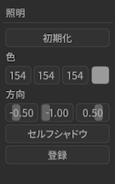

（色選択）
==========================================

光源光の色を設定します

（方向）
==========================================

光源光の方向を設定します

- クリックすると X/Y/Z 軸それぞれのパラメータが表示されます

  - 左右のボタンで 0.01 ずつ増減調整出来ます
  - 空白部分をドラッグすると移動した分のパラメータが増減します

.. caution::
   「登録」でキーフレームに登録されない限りフレーム切り替えで消失します

セルフシャドウパネル
==========================================

セルフシャドウパネルを開きます。以下を設定することが可能です。

モード
------------------------------------------

距離
------------------------------------------

セルフシャドウがカバーする距離を設定します。距離を変えることによる挙動はモードによって変わります

- モード１（バランス型）の場合

  - 小さくするとカメラに近いオブジェクトのセルフシャドウが細かくなる

    - かわりに遠い部分のセルフシャドウが切り捨てられる

  - 大きくするとカメラから遠いオブジェクトのセルフシャドウがかかる

    - かわりにカメラに近いオブジェクトのセルフシャドウが荒くなる

- モード２（近距離重視）の場合

  - モード１よりも小さくしたときのセルフシャドウがより細かくなる
  - モード１と違って大小によってセルフシャドウが途切れるな挙動はない

初期化
------------------------------------------

セルフシャドウの設定を初期化します。

登録
------------------------------------------

現在のフレーム位置に対してセルフシャドウのキーフレームを登録します。

初期化
==========================================

:ref:`23D832D7-4833-4A91-BBB0-CFC212380B44` と同じです

.. _E6F3DE0F-97F9-4515-ABC0-58B8999A9E70:

モデルパネル
******************************************

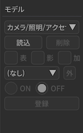

.. _62EB4D2C-F84D-4B9A-A942-4216F524C01A:

（モデルの選択）
==========================================

.. note::
   30.3.0 からモデルの名前変更機能が追加されました

.. important::
   プロジェクト内で使われるモデル名なのでここでモデル名を変更しても読み込まれたモデルを直接書き換えるような変更はありません

一覧からモデルを選択します。

コントロールキーを押しながらクリックするとプロジェクト内のモデルの名前変更ができます（エンターキーを押すとモデル選択に戻ります）。同じモデルを読み込ませた場合で名前を区別するときに利用してください。

読込
==========================================

:ref:`3F20FD13-9F9B-49FD-9072-0DE3FE50CE58` と同じです

削除
==========================================

:ref:`C517500C-9222-4799-A970-7F2910AC4B37` と同じです

可視
==========================================

モデルの表示と非表示を切り替えます。

- モデルを非表示すると付随するエッジや影も非表示になります
- カメラから外れてて見えないモデルは非表示にしたほうが描画速度が向上します
- 「登録」でキーフレームに登録されない限りフレーム切り替えで消失します

影
==========================================

モデルに付随する影の表示と非表示を切り替えます。

加算
==========================================

（IK ボーンの選択）
==========================================

IK ボーンを選択します。IK ボーンの選択状態は `On` と `Off` ボタンの切り替えのみ使われます

.. _7A2F7651-1FF4-4669-861B-3A687D468E31:

外（外部親設定）
==========================================

.. note::
   プロジェクト及び NMD にはモデルのキーフレームとして記録されますが、技術的仕様で VMD には記録されません

モデルの外部親を設定します。

この機能は接続先モデルとそのボーンを設定することにより元モデルの位置及び回転の計算を自動的に行なってくれます。
これにより例えば接続先親モデルに装備品となるモデルをもたせるような動きで必要なモデルの位置及び回転の計算を肩代わりしてくれます。

同様の機能は「アクセサリ」パネルの「:ref:`CE92F96B-DB6C-483C-B698-8781ACE017C4`」がありますが、こちらはアクセサリ専用です。

対象ボーン
------------------------------------------

接続元モデルの基準となるボーンを設定します。

接続先親モデル
------------------------------------------

.. note::
   自分自身（＝接続元モデルと接続先親モデルが同じ）にも設定できます

追従する外部親のモデルを設定します。

接続先親ボーン
------------------------------------------

追従する外部親のモデルのボーンを設定します。

外部親登録
------------------------------------------

「対象ボーン」、「接続先親モデル」及び「接続先親ボーン」を元にモデルのキーフレームを登録します。

On
==========================================

選択された IK ボーンを有効にします

.. caution::
   「登録」でキーフレームに登録されない限りフレーム切り替えで消失します

Off
==========================================

選択された IK ボーンを無効にします

.. caution::
   「登録」でキーフレームに登録されない限りフレーム切り替えで消失します

登録
==========================================

モデルの可視状態と IK ボーンの状態をキーフレームに登録します。

.. _54B1F974-2B39-4472-B6F5-EAB40FDCC4F7:

ボーンパネル
******************************************

.. note::
   モデルが選択されている場合のみ表示されます

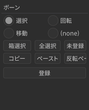

.. _BE2EE075-599C-4F58-A87D-15665E8DE8BA:

選択モード（ボーン）
==========================================

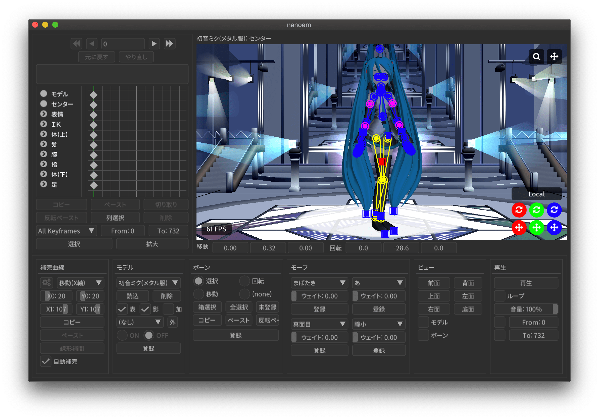

選択モードに切り替えます。

- ボーンの中心点とそれぞれを接続する線が描画されます

  - ボーンの中心点をクリックするとボーンを選択することが出来ます
  - ボーンの中心点付近を移動するとボーン名が表示されます

- ボーンが「選択」に対応していない場合はボタンが無効になりクリックすることが出来ません
- ボタンを連続してクリックすると「選択」と「モードなし」で切り替えることが出来ます

ボーンは以下の条件に基づいて色がつけられます。また、移動可能なボーンは🔶で、回転可能なボーンは🟠で表示されます。

.. csv-table::

   条件,表示される色
   選択されている,赤
   変更してるがキーフレームに未登録,緑
   IKリンク,黄
   固定軸がある,紫
   それ以外,青

.. _A6163404-A26F-4AC3-86FF-689CC6F857E4:

回転モード（ボーン）
==========================================

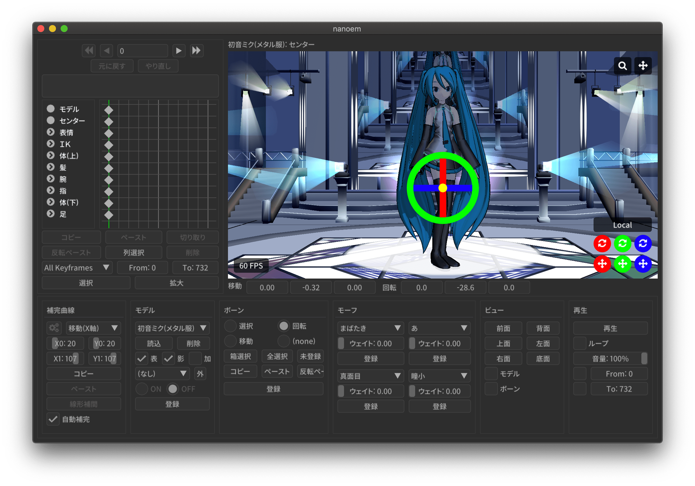

回転モードに切り替えます。選択してるボーンを中心に回転ハンドルが表示され、以下の条件に基づいて動作します。

.. csv-table::

   ドラッグ箇所,結果
   赤の部分,X軸を中心に回転する
   緑の部分,Y軸を中心に回転する
   青の部分,Z軸を中心に回転する
   黄の部分,何も反応しない

- ボーンが「回転」に対応していない場合はボタンが無効になりクリックすることが出来ません
- ボタンを連続してクリックすると「回転」と「モードなし」で切り替えることが出来ます
- 「登録」でキーフレームに登録されない限りフレーム切り替えで消失します

  - 「元に戻す」復元可能だが挙動の仕様上ややこしくなるため非推奨

.. _F3CCBD2A-75D2-47E1-805C-31D0F0B6FE3A:

移動モード（ボーン）
==========================================

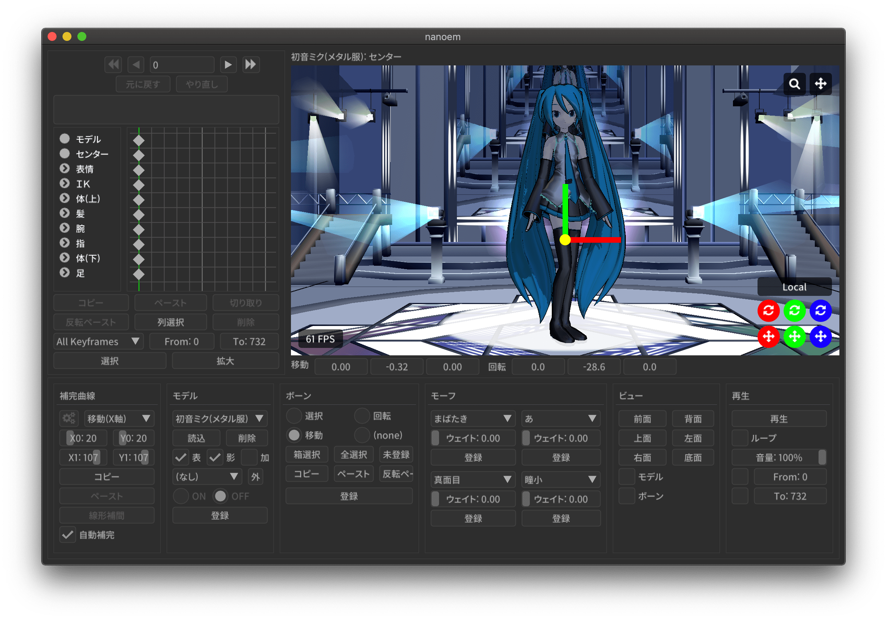

移動モードに切り替えます。選択してるボーンを中心に移動ハンドルが表示され、以下の条件に基づいて動作します。

.. csv-table::

   ドラッグ箇所,結果
   赤の部分,「カメラ視点からみて」X軸固定で移動
   緑の部分,「カメラ視点からみて」Y軸固定で移動
   黄の部分,ドラッグした箇所まで移動

- ボーンが「移動」に対応していない場合はボタンが無効になりクリックすることが出来ません
- ボタンを連続してクリックすると「移動」と「モードなし」で切り替えることが出来ます
- 「登録」でキーフレームに登録されない限りフレーム切り替えで消失します

  - 「元に戻す」復元可能だが挙動の仕様上ややこしくなるため非推奨

.. _18D9F87A-2AA7-441B-8BAA-4CC50B567B26:

箱選択
==========================================

箱選択モードに切り替えます。

- 一度クリックしてドラッグするとドラッグした範囲にあるボーンを全て選択することが出来ます

  - 主にボーンが多い手の部分を全て選択したい場合は「箱選択」を使ったほうがわかりやすく素早いです
  - カメラの位置情報に依存するため、細かく選択したい場合はカメラをズームインしたほうがよいです

- 箱選択を解除したい場合は「回転」、「移動」、「全選択」、「未選択」をクリックすると解除出来ます

全選択
==========================================

モデルにある全てのボーンを選択します。

.. note::
   操作不可能なボーンは除外されます

.. _E28819DE-98C7-4509-8EF7-865A7D2D9799:

未選択
==========================================

ハンドルを用いて移動または回転したもののキーフレームに登録されていないボーンを全て選択します。

- 移動または回転させてかつキーフレームに登録されていないボーンは緑色表示になるのでそれらを全て選択する形です

.. _B2B4FD27-866F-459C-AC92-F6DF01319F73:

コピー
==========================================

選択されたボーンの移動量及び回転量をコピーします

.. note::
   タイムラインや :ref:`A843137E-D975-47B7-86F1-E018BF189873` にあるコピーとは独立しているためそれらと共有することは出来ません

.. _31726C83-C320-417C-975A-C490ADC99635:

ペースト
==========================================

「コピー」されたボーンの移動量と回転量を現在のフレーム位置に対してペーストします

.. note::
  - タイムラインや :ref:`A843137E-D975-47B7-86F1-E018BF189873` にあるコピーとは独立しているためそれらと共有することは出来ません
  - コピーされない限りボタンをおすことは出来ません

反転ペースト
==========================================

ボーン名の先頭に「右」または「左」が含まれている場合、それぞれ「左」または「右」の値になるように調整してペーストします

.. note::
  - タイムラインや :ref:`A843137E-D975-47B7-86F1-E018BF189873` にあるコピーとは独立しているためそれらと共有することは出来ません
  - コピーされない限りボタンをおすことは出来ません

.. _4EDF4607-B9B0-4E2D-A347-3701E240E1EC:

物理
==========================================

.. caution::
   有効から無効に切り替える間は通過補完が発生するため、実際に無効にする数フレーム前に「物理演算有効」のボーンキーフレームを登録してください

ボーンキーフレームの登録時に物理演算を有効にするかどうかのチェックボックスです

- 物理演算が有効なボーンキーフレームはタイムライン上では ❌ マーカーで登録されます
- チェックボックスを外した状態で「登録」をするとボーンに紐づく剛体の物理演算が無効になった状態でボーンキーフレームに登録されます

  - ボーンに剛体が存在する場合にのみ有効です。存在しない場合は普通のボーンキーフレームの登録処理と同じです

- 物理演算が無効になったボーンキーフレームは ❌ から 🔶 に変化します
- 物理演算が無効になったボーンキーフレームを通過する際の剛体は「ボーン追従」扱いになります
- 物理演算の有効無効の状態はプロジェクト及び NMD に保存されます

  - VMD 自体の仕様で VMD には保存されません

登録
==========================================

現在のフレーム位置に対してボーンのキーフレームを登録します。登録後移動または回転されたボーンの中心点の色が緑色から青色に戻ります

.. _D971D5DE-F7A7-4643-9A97-AFB7A8495649:

モーフパネル
******************************************

.. note::
   モデルが選択されている場合のみ表示されます

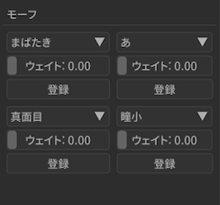

モーフパネルはカテゴリごとに以下のように配置されます

.. csv-table::

  **左側**,**右側**
  目,リップ
  まゆ,その他

(モーフ選択)
==========================================

それぞれのカテゴリに属するモーフを選択します。

- 基本は一覧表示でそこから選択する形です
- 左右のボタンでモーフを切り替えることが出来ます

ウェイト
==========================================

モーフのウェイト値を設定します。

- 基本は 0 で 1.0 にするとモーフの変形が行われます
- 空白部分をドラッグするとドラッグした分だけのウェイト値が設定されます
- 「登録」でキーフレームに登録されない限りフレーム切り替えで消失します

  - 「元に戻す」復元可能だが挙動の仕様上ややこしくなるため非推奨

登録
==========================================

現在のフレーム位置に対してモーフのキーフレームを登録します

.. caution::
   登録は「カテゴリごと」に行われるため、別のカテゴリでモーフのウェイトを変えた場合はそれぞれ「登録」を押す必要があります

.. _BBE442C0-390F-4E8C-8095-F4BB138FD2C5:

アクセサリパネル
******************************************

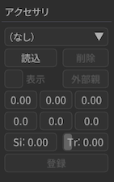

.. _806D1D25-22B4-4DE1-AE54-741A02FF923F:

（アクセサリの選択）
==========================================

.. note::
   30.3.0 からアクセサリの名前変更機能が追加されました

一覧からアクセサリを選択します。

コントロールキーを押しながらクリックするとプロジェクト内のアクセサリの名前変更ができます（エンターキーを押すとアクセサリ選択に戻ります）。同じアクセサリを読み込ませた場合で名前を区別するときに利用してください。

読込（アクセサリ）
==========================================

:ref:`14C11FDE-A0FC-4415-A408-383B0132F735` と同じです

削除（アクセサリ）
==========================================

:ref:`56D86EA0-290E-44E4-B9EA-8A89EC6D486F` と同じです

表示（アクセサリ）
==========================================

アクセサリを表示するかを設定します。チェックを入れると表示、外すと非表示になります。

.. _CE92F96B-DB6C-483C-B698-8781ACE017C4:

外部親（アクセサリ）
==========================================

アクセサリの接続先を設定します。

この機能は接続先モデルとそのボーンを設定することによりアクセサリの位置及び回転の計算を自動的に行なってくれます。
これにより例えば接続先親モデルに装備品となるアクセサリをもたせるような動きで必要なアクセサリの位置及び回転の計算を肩代わりしてくれます。

同様の機能は :ref:`54B1F974-2B39-4472-B6F5-EAB40FDCC4F7` の「:ref:`7A2F7651-1FF4-4669-861B-3A687D468E31`」がありますが、こちらはモデル専用です。

接続先モデル
------------------------------------------

アクセサリが追従するモデルを設定します。デフォルトは地面（不動）です。

接続先ボーン
------------------------------------------

アクセサリが追従するモデルのボーンを設定します。（なし）の場合は接続先モデルが「地面」で設定されているものと同じ扱いになります。

外部親登録
------------------------------------------

現在のフレーム位置に対して「接続先モデル」及び「接続先ボーン」を元にアクセサリのキーフレームを登録します。

移動
==========================================

アクセサリの移動量を設定します

- クリックすると X/Y/Z 軸それぞれのパラメータが表示されます

  - 左右のボタンで 0.01 ずつ増減調整出来ます
  - 空白部分をドラッグすると移動した分のパラメータが増減します

.. caution::
   「登録」でキーフレームに登録されない限りフレーム切り替えで消失します

回転
==========================================

アクセサリの回転量を設定します

- クリックすると X/Y/Z 軸それぞれのパラメータが表示されます

  - 左右のボタンで 0.01 ずつ増減調整出来ます
  - 空白部分をドラッグすると移動した分のパラメータが増減します

.. caution::
   「登録」でキーフレームに登録されない限りフレーム切り替えで消失します

Si
==========================================

アクセサリの拡大率を設定します

.. caution::
   「登録」でキーフレームに登録されない限りフレーム切り替えで消失します

Tr
==========================================

アクセサリの不透明度を設定します

.. caution::
   「登録」でキーフレームに登録されない限りフレーム切り替えで消失します

登録
==========================================

現在のフレーム位置に対してアクセサリのキーフレームを登録します。

ビューパネル
******************************************

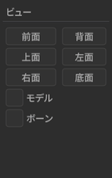

前面
==========================================

カメラの角度を視点として前から見るように調整します

背面
==========================================

カメラの角度を視点として後ろから見るように調整します

上面
==========================================

カメラの角度を視点として上から見るように調整します

左面
==========================================

カメラの角度を視点として左から見るように調整します

右面
==========================================

カメラの角度を視点として右から見るように調整します

底面
==========================================

カメラの角度を視点として下から見るように調整します

.. _6BECA538-F9C4-4628-88EB-7E99C046115F:

モデル ※ 1.20 以降
==========================================

現在選択中のモデル（厳密には特定のボーン）をカメラの目標点として調整し、かつ追従するようにします。これは以下の条件に従って処理されます

.. csv-table::

   操作中心ボーンがある？,センター先の親ボーンがある？,選択されるボーン
   ✅,✅,操作中心ボーン
   ✅,❌,操作中心ボーン
   ❌,✅,センター先の親ボーン
   ❌,❌,モデル最初のボーン

操作中心ボーンは「:ref:`CCDE11E1-3416-425D-80DF-A347F79E7BDD`」で追加することが可能です。

ボーン ※ 1.20 以降
==========================================

現在選択中のボーンをカメラの目標点として調整し、かつ追従するようにします

.. _8DF11AFA-D8D1-4A15-B8E7-B9BBB246C7FD:

再生パネル
******************************************

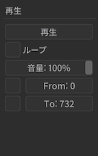

再生
==========================================

現在のプロジェクトを再生します

- 音源が設定されている場合は音源も同時に再生します

ループ
==========================================

ループさせるかを設定します

- 「開始」と「終了」がそれぞれ設定されている場合その範囲内でループします
- デフォルトは無効なので終了まで達した場合はそのまま再生終了する

開始
==========================================

「再生」における開始位置を設定します。

- 左にチェックボックスがあるためそれをチェックする必要がある

  - チェックしていない場合は開始位置設定にかかわらず 0 として認識される
  - デフォルトは無効

- タイムラインにある「開始」とは別

終了
==========================================

「再生」における終了位置を設定します。

- 左にチェックボックスがあるためそれをチェックする必要がある

  - チェックしていない場合は終了位置設定にかかわらず全てのモーションの終端として認識される
  - デフォルトは無効

- タイムラインにある「終了」とは別

音量
==========================================

.. note::
   音量は音源が読み込まれないとスライダーが動かすことが出来ません

音源の音量を 0.0 から 1.0 の範囲内で設定します。

その他
******************************************

.. _C56F44D5-C1AC-45FC-B30A-C86DF0BFBB95:

クラッシュからのプロジェクトリカバリ
==========================================

nanoem がクラッシュしたあとに起動するとリカバリ確認の画面が表示されます。
OK を押すとクラッシュ直前までの操作内容にもとづいてリカバリを行います。

仕組みとして「ヘルプ」に `Open Redo Log Directory` が追加されていますが、
そこで開いたフォルダに操作内容を逐次追記し、クラッシュ時にそれを読み込むことで実現しています。
プロジェクトを作る度に作成されるので、不要であれば随時削除してください。

.. danger::
   読み込んだアクセサリ、モデル、モーションの元となるファイルを移動させると正しく復元することが出来なくなるので一度読み込んだファイルを移動させないようにしてください

以下の操作内容がリカバリ可能です。

* アクセサリの読み込み
* モデルの読み込み
* モーションの読み込み
* キーフレーム登録及び削除

  * アクセサリ
  * ボーン
  * モーフ
  * カメラ
  * 光源

* ボーン変形
* モーフ変形

上記以外の、たとえばアクセサリの透明度や拡大率の設定は対象に入ってないので一回キーフレームに登録してください。

画面変遷の履歴
******************************************

nanoem 1.15 から nanoem 23.x までは UI を全面的に変更し、MikuMikuDance (具体的には 9.26) と出来るだけ似せるように変えてました。

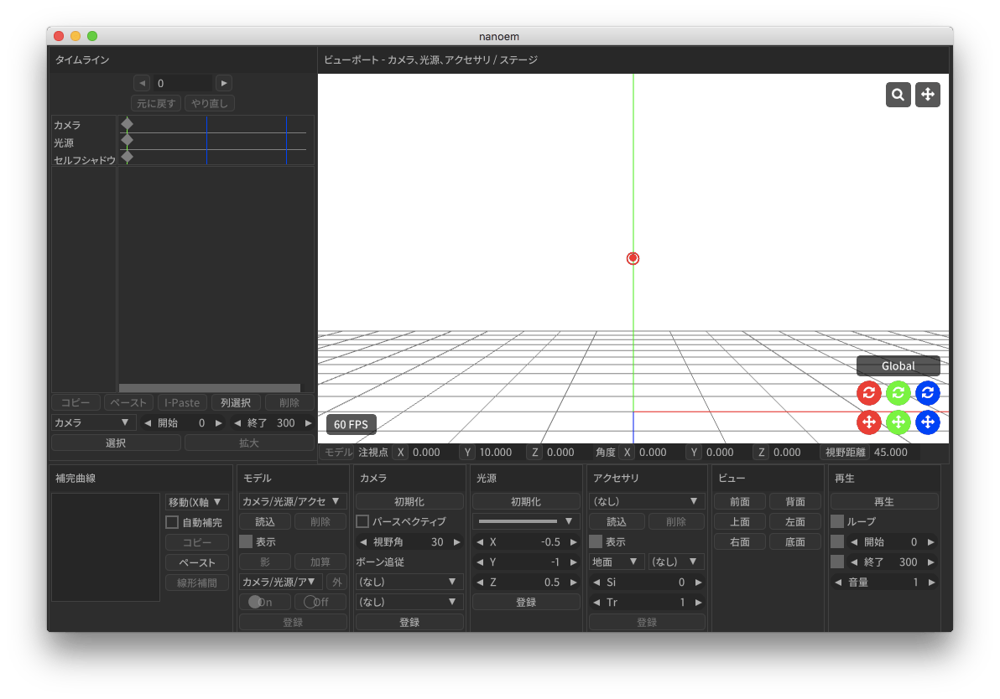

nanoem 1.14

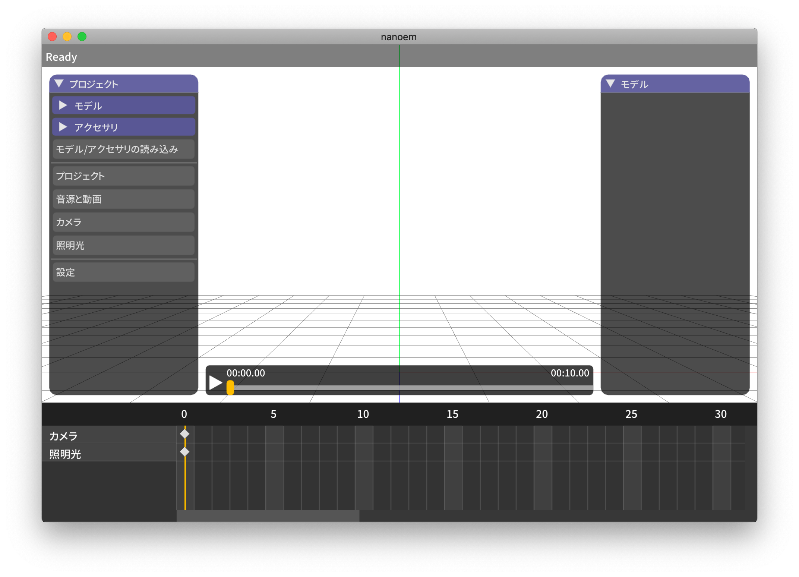

nanoem 1.5

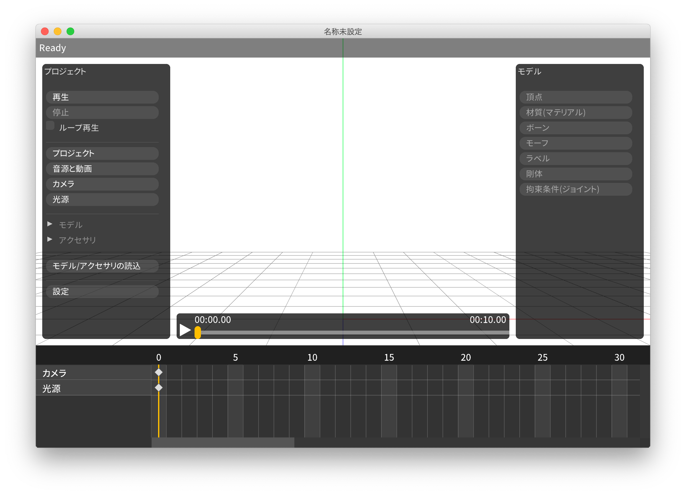
