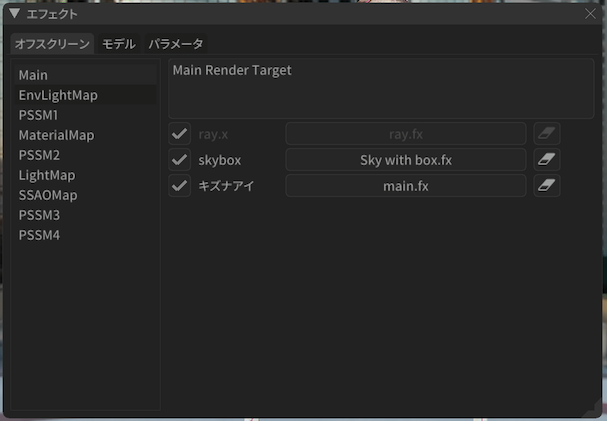
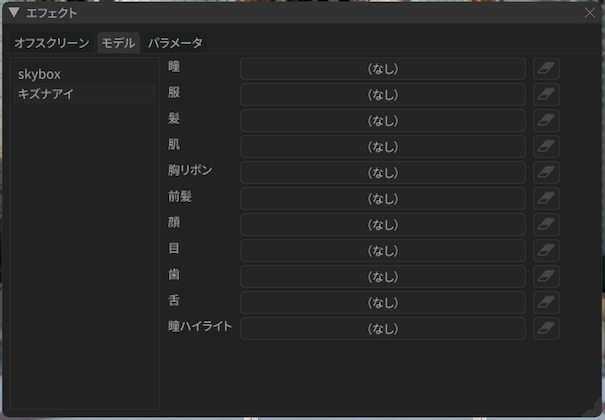
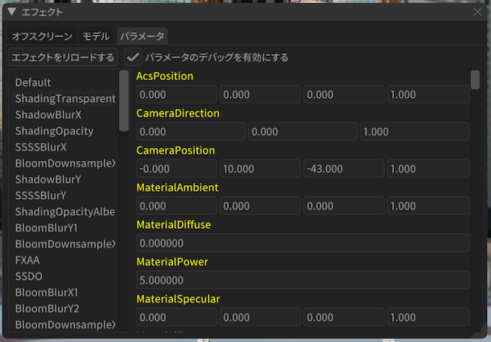
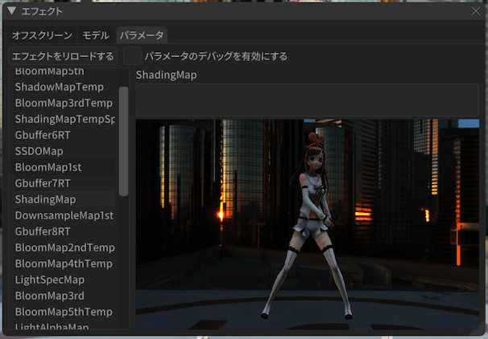

==========================================
エフェクトの設定
==========================================

:ref:`6F3A3C96-A0C9-440C-89B7-0DCC7EB0A5C5` から開くことのできる個々のエフェクト設定画面です。

主に個々のエフェクトの割り当てを変える時に利用します。

.. note::
   スクリーンショットで利用しているものについて

   * モデルは `キズナアイ <https://kizunaai.com/download/>`_ を利用しています
   * エフェクトは `Ray-MMD (1.5.2) <https://github.com/ray-cast/ray-mmd>`_ を利用しています

オフスクリーン
******************************************

オフスクリーンのエフェクト割り当て設定を変えることができます。

* 画面左側にはプロジェクト内で管理しているオフスクリーンエフェクトの一覧が出ます。
* 画面右側は選択されたオフスクリーンの詳細が出ます。

  * 上部にオフスクリーンの説明が表示されます。
  * 下部にはオフスクリーンに適用されているモデルまたはアクセサリの一覧が出ます。

    * ファイル名が表示されたボタンをクリックするとファイルダイアログが表示され、割り当てるエフェクトを変えることができます
    * 消しゴムボタンをクリックすると割り当てを解除することができます
    * グレーアウトされている部分は操作不可能です（例えばオフスクリーン自身のモデルまたはアクセサリである場合）

モデル
******************************************

モデルの材質単位に割り当てるエフェクトの設定を変えることができます。

.. important::
   30.3.0 から MME で使われているモデルのエフェクト割当情報設定ファイルである emd 形式のファイルの読み書きが実装されました。

* 画面左側にはプロジェクト内で管理しているモデルまたはアクセサリの一覧が出ます。

  * 画面左下の「読込」は emd 形式のデータを読込します
  * 画面左下の「保存」は emd 形式のデータを保存します

* 画面右側はモデルの材質に割り当てるエフェクト一覧が出ます。

  * ボタンの部分をクリックするとファイルダイアログが表示され、割り当てるエフェクトを変えることができます
  * 消しゴムボタンをクリックすると割り当てを解除することができます

パラメータ
******************************************

パス、レンダーターゲットの一覧を表示します。「エフェクトをリロードする」ボタンを押すと選択しているモデルまたはアクセサリのエフェクトをリロードすることができます。

.. hint::
   エフェクトのソースコードを書き換えると変更を検知して自動的にリロードする仕組みを持ってるのでそちらの方が簡単です。

   ただし ``include`` されたエフェクトの自動検知は対応していませんので ``include`` している側のエフェクトを書き換える必要があります
   （主に拡張子が ``conf`` や ``fxsub`` のファイルが ``include`` される側のエフェクトです）。

「パラメータのデバッグを有効にする」を有効にするとエフェクトに割り当てられるパラメータの中身を表示します。

レンダーターゲットの場合は上部に説明、下部にレンダーターゲットの中身を画像として表示します。
