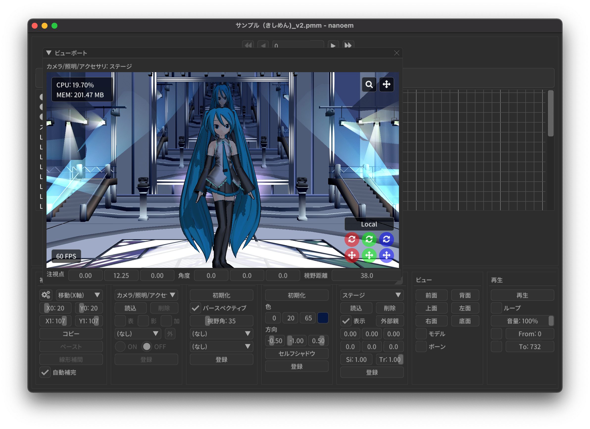

==========================================
アプリケーションのメニュー
==========================================

- ※ ⏪ がついてるものは巻き戻し処理が可能であることを示す

ファイル
******************************************

.. _1F03E7C8-BB94-44D9-B54E-CF707EB6981F:

新規プロジェクト
==========================================

プロジェクトを新規に作成します。

すでに何らかの変更が行われている場合は保存するかどうかの確認ダイアログが表示されます。
新規プロジェクトが行われたあとは元のプロジェクトに巻き戻すことができなくなります。

.. _EEE59B7A-FB14-48E3-B63F-D39AF815CE51:

新規モデル
==========================================

.. note::
   モデル編集用途の機能のためデフォルトでは表示されません。利用する場合は「:doc:`preference`」から「:ref:`F517A3B9-3273-4FE3-BD1E-4EDA53843140`」に✅を入れる必要があります。

   処理の特性上「:ref:`1F03E7C8-BB94-44D9-B54E-CF707EB6981F`」からプロジェクトを作成した場合は一回ファイルに保存してから実行する必要があります。

空のモデルを新規に作成してファイルに保存したうえで追加します。作成されるモデルデータは以下の仕様に基づきます。

* 「センター」ボーンのみ作成される
* 表示枠に「センター」ボーンの特殊枠、及び空要素の「表情」表示枠が作成される
* 頂点、面、材質、モーフ、剛体、ジョイント、ソフトボディはそれぞれ空要素

モデル名は「新規モデル」にランダム生成の文字列の接尾詞がつく形で自動的に作成されます。

プロジェクトを開く
==========================================

以下の形式のプロジェクトファイルを読み込みます。

- ``.pmm``

  - MikuMikuDance におけるプロジェクトファイル
  - 読み込み元のファイル移動させると読み込めなくなる

    - 読み込み元のファイルはモデル、アクセサリ、エフェクト、音源、背景動画が該当します

- ``.nmm``

  - 1.23.0.0 から導入された第三世代のプロジェクトファイル
  - nma 形式と比較して保存は軽いが pmm 形式と同じく読み込み元のファイル移動させると読み込めなくなる

- ``.nma``

  - nanoem における第二世代のプロジェクトファイル
  - 中身は ``zip`` のため拡張子を ``zip`` にして対応する解凍ソフトで解凍することが可能
  - 保存は重い（プロジェクト依存）が別の PC/Mac で読み込むことができる

    - pmm/nmm と違い中身が全て入ってるため読み込み元のファイルを削除しても復元できる

- ``.nanoem``

  - nanoem における第一世代のプロジェクトファイル
  - 読み込み元の音源または背景動画を移動させると当該ファイルだけ読み込めなくなる

    - モデルとアクセサリとエフェクトは中に含まれてるため読み込み元を削除しても読み込める

  - macOS 版のみ

すでに何らかの変更が行われている場合は保存するかどうかの確認ダイアログが表示されます。
プロジェクトファイルを開いて読み込まれた後は元のプロジェクトに巻き戻すことができなくなります。

開く
==========================================

.. _3F20FD13-9F9B-49FD-9072-0DE3FE50CE58:

モデル
------------------------------------------

`.pmd` または `.pmx` 形式のモデルファイルを読み込みます。同じモデルのファイル名に `.fx` がついてる場合はエフェクトも同時に読み込みます。

正常に読み込まれると確認ダイアログが開き `OK` をクリックすることで初めて表示されます。
`キャンセル` をクリックすると以降の読み込みがキャンセルされます（失敗時はエラーダイアログが表示されます）

エフェクトファイルがあり、かつエフェクトプラグインが無効の場合は有効にするかの確認画面が表示されます。
キャンセルした場合はモデル読み込みがキャンセルされます。

.. tip::
   メニューから読み込む方法以外にも以下の方法で読み込むことが出来ます（確認ダイアログが出る点は共通）

   - ファイルを選択し nanoem のウィンドウにドラッグ・アンド・ドロップ
   - 「モデル」パネルの「読み込む」からファイル選択

   また、エフェクトファイルが同時に読み込まれている場合はエフェクトファイルに対して書き換えを行うと自動的にエフェクトをリロードします。

.. _14C11FDE-A0FC-4415-A408-383B0132F735:

アクセサリ
------------------------------------------

`.x` 形式のアクセサリファイルを読み込みます。同じアクセサリのファイル名に `.fx` がついてる場合はエフェクトも同時に読み込みます。

正常に読み込まれるとそのままアクセサリが表示され、「アクセサリ」パネルに読み込まれたアクセサリが追加されます（失敗時はエラーダイアログが表示されます）

エフェクトファイルがあり、かつエフェクトプラグインが無効の場合は有効にするかの確認画面が表示されます。
キャンセルした場合はアクセサリ読み込みがキャンセルされます。

.. tip::
   メニューから読み込む方法以外にも以下の方法で読み込むことが出来ます。

   - ファイルを選択し nanoem のウィンドウにドラッグ・アンド・ドロップ
   - 「アクセサリ」パネルの「読み込む」からファイル選択

   また、エフェクトファイルが同時に読み込まれている場合はエフェクトファイルに対して書き換えを行うと自動的にエフェクトをリロードします。

モデルポーズ
------------------------------------------

.. caution::
  - ポーズが読み込まれてもキーフレームは登録されないためシークすると元に戻ってしまうため必ずキーフレームを登録してください
  - モデルが選択されていないと実行できません

`.vpd` 形式のポーズファイルを読み込みます。

正常に読み込まれるとポーズファイルの内容にあわせてモデルが変形します（失敗時はエラーダイアログが表示されます）。
MikuMikuMoving が採用しているモーフ変形が追加された拡張形式にも対応しています。

モーション
------------------------------------------

`.vmd` または `.nmd` 形式のモーションファイルを読み込みます。

.. _13C2505E-631B-4885-86DA-1AEAFF56BAB9:

モデルモーション
^^^^^^^^^^^^^^^^^^^^^^^^^^^^^^^^^^^^^^^^^

.. important::
   * 33.4 からモーション読み込み後にモデルに含まれるボーン名またはモーフ名と一致するキーフレームが全て選択されるようになりました。
   * 33.0 からモデルに存在しないボーンまたはモーフがキーフレームにある場合は存在しない対象名をダイアログで表示するようになりました。
   * 33.0 からカメラモーションが読み込まれた場合はエラーを出すようになりました。それより前のバージョンでは単純に無視されます。

.. caution::
   モデルが選択されていない場合は実行できません。

モーションファイルを選択されたモデルに対して読み込みます。

選択されたモデルに存在するボーンまたはモーフに対して変形を行います。モーションに登録されてるボーンまたはモーフがモデルに存在しないキーフレームは無視されます。

.. _D9C086C7-EB76-4484-879A-F8DDEBD7B9DC:

カメラモーション
^^^^^^^^^^^^^^^^^^^^^^^^^^^^^^^^^^^^^^^^^

.. important::
   33.0 からモデルモーションが読み込まれた場合はエラーを出すようになりました。それより前のバージョンでは単純に無視されます。

選択されたカメラモーションを読み込み、カメラに対してキーフレームに設定します。

.. _5C9A9AEB-E138-4B4D-9422-A0B6FEAF4CB5:

光源モーション
^^^^^^^^^^^^^^^^^^^^^^^^^^^^^^^^^^^^^^^^^

.. important::
   33.0 からモデルモーションが読み込まれた場合はエラーを出すようになりました。それより前のバージョンでは単純に無視されます。

選択されたカメラモーションを読み込み、光源に対してキーフレームに設定します。

音源
^^^^^^^^^^^^^^^^^^^^^^^^^^^^^^^^^^^^^^^^^

音源をプロジェクトに読み込みます。

.. caution::
   プロジェクトに読み込める音源はひとつまでです。別の音源を読み込んだ場合すでに利用している音源を削除してから読み込まれます。

.. note::
   5.1ch や 7.1ch などのマルチチャンネルを持つ音源も読み込み可能ですが再生処理は利用している OS 及び再生デバイスに依存します。

読み込み可能な音源ファイルは nanoem 自体のバージョン及び中に含まれるコーデックによって異なるため、実際に読み込みできるかを必ず確認してください。

- Windows 版及び macOS 版共通で読み込み可能

  - リニア PCM（いわゆる非圧縮の音源）
  - MP3

- macOS 版で読み込み可能

  - AAC

.. _4BF77CBD-F154-479A-8CC6-83F19677CB04:

背景動画
^^^^^^^^^^^^^^^^^^^^^^^^^^^^^^^^^^^^^^^^^

動画をプロジェクトに読み込みます。読み込まれた動画はビューポートの背景動画として表示されます。

.. note::
   プロジェクトに読み込める動画はひとつまでです。別の動画を読み込んだ場合以前の動画を削除してから読み込まれます。

.. tip::
   動画の位置または拡大率は画面右上のカメラズーム及び矢印アイコンを SHIFT キーを押しながら操作すると可能です。

読み込み可能な動画ファイルは nanoem 自体のバージョン及び中に含まれるコーデックによって異なるため、実際に読み込みできるかを必ず確認してください。

- Windows 版及び macOS 版共通で読み込み可能

  - RawVideo（いわゆる非圧縮の動画）
  - `UtVideo Codec <http://umezawa.dyndns.info/wordpress/?cat=28>`_
  - `Grass Valley HQX Codec <https://pro.grassvalley.jp/download/gv_codec_option.htm>`_

    - ``UtVideo`` 及び ``Grass Valley HQX`` は圧縮動画形式であり展開するためのデコード負荷が大きいため動画によっては FPS を下げる要因になることがあります

.. _8859DEE8-5813-4ED9-945E-0A01BCCF694A:

保存
==========================================

プロジェクトファイルを書き出します。

新規プロジェクトから作成した場合は初回はファイルダイアログが開きます。
また、二回目以降あるいは「プロジェクトを開く」から開いた場合は同じファイルに対して保存します。

- Windows では `.nma` または `.nmd` または `.pmm` 形式
- macOS では `.nma` または `.nmd` または `.pmm` または `.nanoem` 形式

NMA/NMM 形式の保存の制限について
------------------------------------------

- nma/nanoem 形式から nmm/pmm 形式への保存はできません
- nmm 形式から nma/nmd/nanoem 形式に保存することは可能です
- nma 形式から nmm 形式に保存する場合は以下の手順を実施することで可能です

  - nma ファイルを拡張子 zip にリネームして解凍する
  - 新規プロジェクトでプロジェクトをリセットする
  - 解凍して出てきたファイルを全て読み込む
  - nmm 形式で保存する

保存元と保存先のマトリックスは以下のとおりです（下方向は保存元、右方向は保存先を示す）

.. csv-table::

  ,nanoem,nma,nmm,pmm
  nanoem,⭕,⭕,❌,❌
  nma,⭕,⭕,❌,❌
  nmm,⭕,⭕,⭕,⭕
  pmm,⭕,⭕,⭕,⭕

.. _D90328CC-C39A-4854-BB48-B49039D8E31B:

PMM 形式の保存の制限について
------------------------------------------

.. important::
   pmm 形式に書き出すときは元のプロジェクトファイルを保持してください。

   MMD に読み込ませる目的で保存する場合は MMD の実行ファイルと同じ階層にある ``UserFile`` フォルダに保存する必要があります。
   これは MMD の仕様として ``UserFile`` を基準にファイルが読み込まれるためです。

31.0 から pmm 形式の保存が実装されました。ただし仕様の違いから以下の注意点があります。

- MMD 9.0 以降で読み込み可能な PMM 2.0 形式で保存されます

  - MMD 9.0 未満で読み込み可能な PMM 1.0 形式では保存されませんのでご注意ください
  - PMM 1.0 形式への保存の対応予定はありません

- モデル及びアクセサリは両方あわせて最大 255 体までです
- モデルまたはアクセサリのパス名は 255 bytes までです。これより長いと読み込めません

  - 日本語のファイル名を用いた場合は 255 bytes より短くなります
  - ShiftJIS で保存されるためパス名に絵文字などを使うと読み込めなくなります

- 描画順の仕様の違いにより書き出し時にすべてのモデル、すべてのアクセサリの順番で保存します

  - 例えば「モデル、アクセサリ、モデル」の描画順の場合は「モデル、モデル、アクセサリ」に整理されます

- MMD の仕様で読み込み可能なキーフレーム数に上限があります

  - カメラは1万キーフレーム、モデルは5万キーフレームを上限とする制約があるようです
  - 大量のキーフレームが登録される「:ref:`10C1A1A4-7F7F-479A-A264-2FF9EB4577D4`」を実施するとキーフレーム数制約が引っかかる可能性があります

- 表示枠の開閉状態は保存されず、全て閉じた状態で保存されます
- 重力キーフレームは nanoem では未実装のため保存されません

  - キーフレームのみで重力設定自体は保存されます

- レイアウト情報は保存されません
- (33.4 未満の場合のみ) キーフレームの選択状態が保存されません

名前をつけて保存
==========================================

プロジェクトの変更状態に関係なく常にファイルダイアログが開いて保存先を指定する必要があることを除いて「:ref:`8859DEE8-5813-4ED9-945E-0A01BCCF694A`」と同じです。

書き出し
==========================================

モデルポーズ
------------------------------------------

.. caution::
  - モデルポーズはモーションと異なりキーフレームではなく「全てのボーン及びモーフの状態」を保存します

    - 上記の仕様によりキーフレーム登録してなくても変形状態が保存されます

現在のフレーム位置から選択された全てのボーン及びモーフの状態を `.vpd` 形式としてファイルに書き出します。

モデルモーション
------------------------------------------

.. caution::
  - モデルが選択されていないと実行できません
  - モーション読み込み時にボーンまたはモーフがモデルに存在せずに無視されたキーフレームは登録されません

選択されたモデルにある全てのキーフレームを `.vmd` または `.nmd` 形式としてファイルに書き出します。

カメラモーション
------------------------------------------

カメラの全てのキーフレームを `.vmd` または `.nmd` 形式としてファイルに書き出します。

光源モーション
------------------------------------------

光源の全てのキーフレームを `.vmd` または `.nmd` 形式としてファイルに書き出します。

モデル ※ 1.20 以降
------------------------------------------

現在選択中のモデルを `.pmx` 形式としてファイルに書き出します。

.. caution::
   * nanoem 起動時に設定項目の「モデル編集機能を有効にする」が ✅ されてないと表示されません。そのため、当該項目を ✅ したあとに nanoem を再起動する必要があります
   * 書き出し先は読み込み時と同じフォルダに指定してください。モデルフォーマットの仕様として違うフォルダで書き出すとテクスチャが正しく表示されなくなります

画像（書き出し）
------------------------------------------

.. hint::
   * 透過を含める場合は `.png` 形式で出力してください。それ以外の形式だと透過を含むことができない仕様のため正しく表示されないことがあります。
   * 画像出力は一回物理演算をリセットしてフレーム移動を行ってから書き出しを行う仕組みとなっています。この仕様により、そのまま画像出力を行うと物理演算を再現出来ない問題があります。

     * 物理演算を維持して書き出したい場合は「:ref:`10C1A1A4-7F7F-479A-A264-2FF9EB4577D4`」を行って画像出力用のプロジェクトとして書き出した後に画像出力を行ってください。

現在のフレーム位置のビューポートを画像として書き出します。以下の手順により書き出しが始まります。

1. プロジェクトが未保存の場合プロジェクト保存の確認画面が出ます
2. 最初に書き出し設定（サイズ指定など）のダイアログが出ます
3. 保存先を指定するファイルダイアログが開きます
4. 保存先に画像書き出しが始まります

.. _A83521E4-540E-4C96-8093-07684B994454:

動画（書き出し）
------------------------------------------

動画としてファイルに書き出します。以下の手順により書き出しが始まります

.. note::
   * 出力される動画のフレームレートは「再生時フレームレート」に依存し 30FPS または 60 FPS です。ドロップフレームはありません。

     * 例えばドロップフレームを入れたい、あるいは 24 FPS に落としたい場合は「:ref:`28185A65-88E5-4C4C-BF60-41BBB5520B70`」に紹介されている動画編集ソフトを利用して変更してください。

.. hint::
   * 透過を含める場合は「:ref:`8DE98D42-1894-4002-B629-4D64580EF404`」を参照してください。
   * 動画出力は画像出力と同じように一回物理演算をリセットしてフレーム移動を行ってから書き出しを行う仕組みとなっています。これはフレームの範囲指定をした場合に物理演算を再現出来ない問題があります。

     * そのため、物理演算を維持して書き出したい場合は「:ref:`10C1A1A4-7F7F-479A-A264-2FF9EB4577D4`」を行って動画出力用のプロジェクトとして書き出した後に動画出力を行ってください。

1. プロジェクトが未保存の場合プロジェクト保存の確認画面が出ます
2. 動画設定のダイアログが開きます
3. （「OS 付属のエンコーダを有効にする」の設定によって変化します）

  - 「OS 付属のエンコーダを有効にする」にチェックした場合は 4 に進みます
  - 「OS 付属のエンコーダを有効にする」にチェックを外した場合は Plugins からプラグインを指定します

    - どれを使うか迷う場合は ``plugin_lsmash`` を推奨します

4. 保存先を指定するファイルダイアログが開きます
5. 保存先に動画書き出しが始まります

.. note::
   画像書き出しと違って動画書き出しは時間がかかりかつ負荷のかかる作業のため、書き出し前は一旦 nanoem 以外のアプリケーションを全て終了させ、書き出し中は他のアプリケーションを立ち上げたりせずに待ちましょう。

出力解像度
^^^^^^^^^^^^^^^^^^^^^^^^^^^^^^^^^^^^^^^^^^^

動画出力するときの解像度を以下から選択します。

- ビューポートと同じ
- Application Default (960x640)
- XGA (1024x768)
- 720p (1280x720)
- WXGA (1600x900)
- UXGA (1600x1200)
- 1080p (1920x1080)
- WUXGA (1920x1200)
- WQHD (2560x1440)
- WQXGA (2560x1600)
- 4K (3840x2160)
- 8K (7680x4320)

「ビューポートと同じ」は「:ref:`305111E6-1E3B-425E-84E2-8227A6FA94C9`」の「出力サイズ」の設定が使われます。解像度が高ければ高いほど出力に時間がかかります。

ビューポートのアスペクト比を維持
^^^^^^^^^^^^^^^^^^^^^^^^^^^^^^^^^^^^^^^^^^^

有効にするとビューポートのアスペクト比を利用して出力します。

これにより無効時の出力解像度からアスペクト比を決定することによる歪みを防ぐことができます。
また縦長解像度（出力解像度に選択肢がないためビューポート設定の必要あり）の出力を正しく行うことができるようになります。

無効にすると 26.0 より前と同じ挙動で出力解像度からアスペクト比が決定されます。

フレームズレ抑止を有効にする
^^^^^^^^^^^^^^^^^^^^^^^^^^^^^^^^^^^^^^^^^^^

垂直同期を上回るフレームレートを出すとフレーム移動の際にズレが生じることがあるため、これを抑止します。

無効にすると垂直同期が無効になるため書き出し速度が早くなりますが、先のフレームズレの問題が生じるためあくまで製作途中の確認用として使ってください。
「OS 付属のエンコーダを有効にする」を有効にしている場合は影響を受けません。

アンチエイリアス設定
^^^^^^^^^^^^^^^^^^^^^^^^^^^^^^^^^^^^^^^^^^^

.. note::
   デフォルトでは「最高設定」になっていますが、環境によっては「:ref:`596AB6F3-51F6-4C4C-8A0A-5428B6381499`」のような問題が発生することがあります。
   一回「:ref:`6D009308-F906-4BFB-B118-17DB0B526DA0`」で確認して問題が発生した場合はこちらについても無効にしてください。

:ref:`6D009308-F906-4BFB-B118-17DB0B526DA0` と同じですが、動画出力するときのみ適用されます。出力完了後は出力前の設定に復元されます。

出力範囲
^^^^^^^^^^^^^^^^^^^^^^^^^^^^^^^^^^^^^^^^^^^

動画を出力する範囲を設定します。デフォルトはプロジェクト全体（最初から最後まで）です。

Plugins
^^^^^^^^^^^^^^^^^^^^^^^^^^^^^^^^^^^^^^^^^^^

.. caution::
   34.1 未満で ``plugin_ffmpeg`` を利用して出力する場合はステレオかつ周波数 44100Hz の音源を利用してください。
   これは不具合起因によるものであり、34.1 で修正されています。

動画書き出しに利用するプラグインを指定します。

- ``plugin_avfoundation`` (macOS 版のみ)

  - AVFoundation を使った動画出力をするプラグインです
  - 保存可能な形式は mp4/mov です
  - 設定可能な項目はありません

- ``plugin_ffmpeg``

  - ffmpeg の内部ライブラリを使った動画出力するプラグインです
  - 保存可能な形式は avi のみです
  - Video Codec

    - 保存する動画形式で以下から選択します

      - Raw Video

        - 無圧縮動画で実質的に plugin_lsmash と同一です

      - UT Codec Video

        - 可逆圧縮動画で圧縮処理のために保存に時間がかかるかわりにサイズを概ね半分にできます

  - Video Pixel Format

    - 動画出力で格納する画像の保存形式で以下から選択します

      - RGB
      - RGBA
      - YUV420P
      - YUV422P
      - YUV444P

    - 基本は RGB を、透過を利用する場合は RGBA を、色の劣化を許容してでもサイズを小さくしたい場合は YUV をそれぞれ使います

  - Audio Codec

    - 現時点で PCM のみです
    - 音源がモノラルの場合はステレオに変換されます
    - 音源が 44100Hz 未満の周波数の場合は 44100Hz に引き上げられる形で変換されます
    - 16bit 以外の音源を利用している場合は一律で 16bit に正規化されます

- ``plugin_lsmash``

  - 無圧縮動画を出力するプラグインです

    - AviUtl のプラグインのひとつである `lsmash-works <https://pop.4-bit.jp/?page_id=7929>`_ とは別物なのでご注意ください

  - 保存可能な形式は mov のみです
  - Estimated export video size は動画出力後の見積もりサイズです

    - 例えば 3分間 の 1280x720 の 60FPS の動画を出力すると約 30GB になります

- ``plugin_gif``

  - gif を出力するプラグインです
  - 保存可能な形式は gif のみで、設定可能な項目はありません
  - エンコード処理の関係上、動画出力完了後すぐに画面が戻りませんが時間経過により復帰します
  - 将来的に廃止される可能性があるため利用非推奨です

    - 代替手段として mp4 形式で動画出力し、`gifski <https://apps.apple.com/jp/app/gifski/id1351639930?mt=12>`_ を利用してエンコードすることを推奨します

OS 付属のエンコーダを有効にする
^^^^^^^^^^^^^^^^^^^^^^^^^^^^^^^^^^^^^^^^^^^

.. note::
   利用可能かどうかは OS によって変わります。Windows と macOS は利用可能でそれ以外は利用できません。

OS に組み込まれているエンコーダを利用します。プラグイン経由と比較してより高速な出力が期待できます。

一方で「:ref:`19861EBC-2EFD-4FB8-A9A3-796E826F337D`」にあるように完全な形で動画が書き出されるとはいえないことがあるため基本的に仮出力用途で利用してください。

有効にした場合は以下の設定が追加されます。

音声コーデック
^^^^^^^^^^^^^^^^^^^^^^^^^^^^^^^^^^^^^^^^^^^

動画出力時に音源が読み込まれてる場合に選択可能です

デフォルトは `AAC` のみですが、動画出力時のファイルの拡張子を `mov` にすると `Apple Lossless` と `Linear PCM` が追加で選択出来ます

動画コーデック
^^^^^^^^^^^^^^^^^^^^^^^^^^^^^^^^^^^^^^^^^^^

デフォルトで `H.264/AVC` のみですが、動画出力時のファイルの拡張子を `mov` にすると `Apple ProRes 422` と `Apple ProRes 4444` が追加で選択出来ます

動画のピクセル形式
^^^^^^^^^^^^^^^^^^^^^^^^^^^^^^^^^^^^^^^^^^^

現時点で `RGBA 8bits` のみ選択可能です。

今後の HDR 対応により `RGB 10bits A 2bits` と `RGBA 16bits float` の追加予定があります。

動画プロファイル
^^^^^^^^^^^^^^^^^^^^^^^^^^^^^^^^^^^^^^^^^^^

動画プロファイルは動画コーデックに `H.264/AVC` を選択した場合のプロファイルを設定します。それ以外のコーデックでは無視されます。

終了
==========================================

アプリケーションを終了させます。

プロジェクトに未保存の変更があった場合終了確認の画面が出ます。

編集
******************************************

.. _0AB17EB2-3D7A-4E91-82A4-B888C02415C8:

元に戻す
==========================================

.. important::
   27.0.0 よりプロジェクト単位のみからプロジェクト単位（カメラモード時）とモデル単位（モデル選択時）で分離されました。
   これにより以下の変更があります。

   * モデル操作はモデル単位で独立して「元に戻す」が可能になります
   * モデル単体で完結しない操作（例えばフレーム挿入または削除）はプロジェクト単位で記録されるため一回カメラモードに切り替える必要があります
   * アクセサリ操作はカメラモードから操作する関係でプロジェクト単位で記録されます

前回の操作を巻き戻します。

  - ボーン操作などの操作中にフレーム移動が発生した場合は移動前に実施した処理が「元に戻す」の起点となります
  - 「元に戻す」及び「やり直し」の操作は **64** 回まで保存されます。それ以上前の操作は消去されます
  - マウス側に「元に戻す」ボタンがあってそれを押された場合は「元に戻す」の処理が実行されます

.. _E3DC7DFA-5EAB-4F58-88F0-151FBDC1008D:

やり直し
==========================================

.. caution::

    - 一回「元に戻す」で別の操作を行った場合はやり直しができなくなります

      - 例として `A -> B -> [元に戻す] -> A -> C` とした場合　`B` の操作は失われる

「元に戻す」で戻した操作を取り消します。

  - 「元に戻す」及び「やり直し」の操作は **64** 回まで保存されます。それ以上前の操作は消去されます。
  - マウス側に「やり直し」ボタンがあってそれを押された場合は「やり直し」の処理が実行されます

切り取り ⏪
==========================================

選択された全てのキーフレームをコピーした上で削除します。

コピー
==========================================

モデルが選択されててかつボーンパネルが「選択」状態の場合は選択されたボーンの移動及び回転の状態をコピーします。

それ以外の場合は選択された全てのキーフレームをコピーします。

貼り付け ⏪
==========================================

モデルが選択されててかつボーンパネルが「選択」状態の場合は選択されたボーンの移動及び回転の状態を上書きする形で貼り付けします。

それ以外の場合は「コピー」あるいは「元に戻す」で選択されたキーフレームを現在のフレーム位置を基準にペースト（貼り付け）します。

.. note::
   キーフレームが重なる場合はコピーされたキーフレームが優先され、登録されているキーフレームは上書きされます。

全てのキーフレームを選択
==========================================

全てのキーフレームを選択します。

カメラモードの場合はカメラ、光源に登録されている全てのキーフレームを選択します。

モデルモード（モデルが選択されている）の場合はモデル、ボーン、モーフに登録されている全てのキーフレームを選択します。

モーション
==========================================

.. _D517E599-B45B-40DF-8F59-623DA311E638:

空フレームを挿入 ⏪
------------------------------------------

現在のフレームを基準に基準より後ろに登録されているキーフレームを全てひとつ後にずらします。

対象となるモーションは以下の上から順番に処理されます。

.. csv-table::

  **前提条件**,**対象**
  モデルが選択されている場合,選択されたモデルのモーション
  モデルが選択されていない場合,カメラ/照明/セルフシャドウ 及び全てのアクセサリのモーション

現在のフレームを削除 ⏪
------------------------------------------

現在のフレームを基準に基準より後ろに登録されているキーフレームを全てひとつ前にずらします。
ずらした先にキーフレームが登録されている場合そのキーフレームは削除されます。

対象となるモーションは「:ref:`D517E599-B45B-40DF-8F59-623DA311E638`」に従います。

初期化 ⏪
------------------------------------------

選択されたモーションの全てのキーフレームを削除し、最初にあるキーフレームを初期化します。

初期化対象となるモーションは以下の上から順番に処理されます。

.. csv-table::

  **前提条件**,**対象**
  モデルが選択されている場合,選択されたモデルのモーション
  アクセサリが選択されている場合,選択されたアクセサリのモーション
  上記のどちらも当てはまらない場合,カメラ/照明/セルフシャドウ のモーション

ボーン
==========================================

数値入力ダイアログを開く ⏪
------------------------------------------

選択されたボーンに対する数値入力のダイアログを開きます。

ビューポート下にある数値入力と同じです。

.. _54256F37-C4E0-4642-9AB4-8720FACBE207:

補正ダイアログを開く ⏪
------------------------------------------

.. note::
   あらかじめ補正対象となるボーンキーフレームを選択する必要があります。何も選択されていない場合は一切補正されません。

補正ダイアログを開きます。

選択された全てのボーンのキーフレームの移動、回転を対象に乗算及び加算を用いて数値を調整します。
主に大きさが異なるモデルのためにモーション全体の動きを一括で補正するときに使います。

バイアス指定ダイアログを開く
------------------------------------------

バイアス指定ダイアログを開きます。

選択モード
------------------------------------------

ボーンを選択するための選択モードに切り替えます。

回転モード
------------------------------------------

ボーンを回転させるための回転モードに切り替えます。

移動モード
------------------------------------------

ボーンを移動させるための回転モードに切り替えます。

角度をリセット ⏪
------------------------------------------

選択されたボーンの X/Y/Z 軸の角度をすべて０にリセットします。

カメラ
==========================================

数値入力ダイアログを開く ⏪
------------------------------------------

カメラに対する数値入力のダイアログを開きます。

ビューポート下にある数値入力と同じです。

補正ダイアログを開く ⏪
------------------------------------------

.. note::
   あらかじめ補正対象となるカメラキーフレームを選択する必要があります。何も選択されていない場合は一切補正されません。

補正ダイアログを開きます。

選択された全てのカメラのキーフレームの注視点、角度、視野距離を対象に乗算及び加算を用いて数値を調整します。

角度をリセット ⏪
------------------------------------------

カメラの X/Y/Z 軸の角度を０にリセットします。

注視点や視野距離も一緒にリセットしたい場合はカメラパネルの「初期化」を使用してください。

モーフ
==========================================

補正ダイアログを開く ⏪
------------------------------------------

補正ダイアログを開きます。

選択された全てのモーフのキーフレームのウェイトを対象に乗算及び加算を用いて数値を調整します。

唇のキーフレームを削除 ⏪
------------------------------------------

唇カテゴリの全てのキーフレームを選択状態にかかわらず削除します。

目のキーフレームを削除 ⏪
------------------------------------------

目カテゴリの全てのキーフレームを選択状態にかかわらず削除します。

まゆのキーフレームを削除 ⏪
------------------------------------------

まゆカテゴリの全てのキーフレームを選択状態にかかわらず削除します。

全てのモーフをリセット ⏪
------------------------------------------

全てのモーフのウェイトを選択状態にかかわらず０にリセットします。

全てのキーフレームを登録 ⏪
------------------------------------------

現在のフレーム位置にある全てのモーフをキーフレームに登録します。

すでに登録されている場合は無視されます。

.. _6F3A3C96-A0C9-440C-89B7-0DCC7EB0A5C5:

エフェクト設定ウィンドウを開く
==========================================

.. important::
   エフェクトファイル単体のドラッグ&ドロップはエフェクト設定ウィンドウが開いている時のみ利用可能です。
   開いていない時にドラッグ&ドロップをするとエラーが表示されます。

エフェクト設定ウィンドウを開きます。

詳細は「:doc:`effect`」を参照してください。

.. _5A6CDB09-18D8-4D55-9D35-6FEF0A0B62FF:

モデル編集ウィンドウを開く
==========================================

.. caution::
   * nanoem 起動時に設定項目の「:ref:`F517A3B9-3273-4FE3-BD1E-4EDA53843140`」が ✅ されてないと表示されません。
   * この機能は今後仕様が変化する可能性があります

モデル編集ウィンドウを開きます。詳細は :doc:`model` を参照してください。モデルが選択されていない場合は実行できません。

.. _7F24495C-52C6-4659-A309-0E75CAB72D3B:

モデルプラグイン
==========================================

モデルプラグインを実行します。モデルが選択されていない場合は実行できません。

利用可能なプラグインは :doc:`plugin` を参照してください。

.. _7BFC3B84-55EB-4E4B-A827-4E53401DC0AE:

モーションプラグイン
==========================================

モーションプラグインを実行します。モデルが選択されている場合はモデルのモーションに、モデルが選択されていない場合はカメラ、照明、アクセサリのモーションに対して適用します。

利用可能なプラグインは :doc:`plugin` を参照してください。

設定
==========================================

.. caution::
   macOS 版ではこの項目は出ず、 nanoem > 設定... が該当します。

設定ウィンドウを開きます。詳細は :doc:`preference` を参照

プロジェクト
******************************************

再生
==========================================

.. important::
   音源が含まれている場合は再生デバイスの構成変更により再生中の挙動が変わります。構成変更の検知は OS の仕組みを利用するため場合によっては検知できないことがあります。また、この挙動を設定から変更することはできません。

   * 新しい再生デバイス追加を検知した場合は再生を一時停止し、再生デバイスを変更してから再開して再生を続けます

     * 例えばイヤフォンをイヤフォンジャックに差し込んだ場合が該当します

   * 再生デバイスの離脱を検知した場合は再生を一時停止しますが、再生デバイスを変更した後の再開を行いません

     * 例えばイヤフォンがイヤフォンジャックから外れて別の再生デバイスに切り替わる場合が該当します
     * これについては別の再生デバイスで再生される際の時の意図しない音漏れを防ぐためです

現在のフレーム位置からプロジェクトを再生します。

停止（再生中の場合は「再開」）
==========================================

再生中のプロジェクトを停止します。再生中の場合は現在位置から再生を再開します。

.. _305111E6-1E3B-425E-84E2-8227A6FA94C9:

ビューポート設定ダイアログを開く
==========================================

ビューポートの設定を変更するためのダイアログを開きます。

* 出力サイズ (幅 / 高さ)

  * ビューポートに表示する大きさの既定値を設定します
  * ウィンドウサイズの大きさにあわせて計算されるため実際に表示される大きさは異なります

    * 最小値である 1x1 に設定しても実際に表示される大きさは 1x1 ではありません

  * 既定値は 640x360 です

* 出力背景色

  * ビューポートに表示する背景色を設定します
  * 透過度の設定が可能です

    * 透過度を 0 にすると黒背景になります

  * 既定値は白です（R=255 / G=255 / B=255 / A=255)

描画順ダイアログを開く
==========================================

モデルの描画順を操作するダイアログを開きます。

  * 描画順は上から順番に適用され描画されます

    * 画像の例では「ステージ」、「ダミーボーン」、「奥大赤右」の順番で描画されます

  * Up ボタンを押すと選択対象を上に移動（描画順が先になる）します
  * Down ボタンを押すと選択対象を下に移動（描画順が後になる）します

.. note::
   描画の仕様により、透過部分が含まれるモデルは描画順ダイアログを用いて後ろに描画するように調整する必要があります

変形順ダイアログを開く
==========================================

モデルの変形順を操作するダイアログを開きます。

  * 変形順は上から順番に変形されます

    * 画像の例では「ダミーボーン」、「初音ミク（メタル服）」の順番で描画されます

  * Up ボタンを押すと選択対象を上に移動（変形順が先になる）します
  * Down ボタンを押すと選択対象を下に移動（変形順が後になる）します

.. tip::
   この機能は外部親を設定する際に外部親先が先に変形するように順序を変えるためにあります。設定し忘れると外部親が正しくが行われなくなります。

.. _5BB93875-36E2-42A2-B232-BD61D8FD131D:

ビューポートウィンドウを分離
==========================================

ビューポート描画部分を独立したウィンドウとして分離します。

分離したビューポートウィンドウはウィンドウ右上の閉じるボタンで分離前の状態に戻すことができます。

.. _02057C79-773C-4BE2-985C-FD2551914FA0:

地面軸を有効にする
==========================================

地面に設定された軸を表示するかを設定します。初期値は有効です。

.. _218DEFCD-1BB7-48FF-8A38-483361C2AE76:

地面影を有効にする
==========================================

.. important::
   地面影はセルフシャドウとは別です

地面に出来る影の表示を有効にするかを設定します。初期値は有効です。

.. _06ABE712-6592-4A14-9AEC-0DDEC4B4C9DC:

エフェクトを有効にする
==========================================

MME 形式のエフェクトを有効にするかを設定します。初期値は無効です。

無効の場合はエフェクトを伴うアクセサリまたはモデル読み込み時に有効にするかどうかのダイアログが表示されます。

.. warning::
   バージョンによってエフェクトが使えたり使えなかったりする上に適用後の見た目が変わることがあります。適用後の描画が正しいかどうかはエフェクト配布元の適用後参考画像を確認したほうがよいです

.. _6D009308-F906-4BFB-B118-17DB0B526DA0:

アンチエイリアス設定
==========================================

.. caution::
   有効にするとハードウェアによっては目に見えて重くなったり「:ref:`596AB6F3-51F6-4C4C-8A0A-5428B6381499`」に挙げられるような意図しない不具合が発生することがあります。その場合は無効にしてください。

   また、エフェクトによってはアンチエイリアス機能と干渉する場合があります。通常はエフェクトの取扱説明書にアンチエイリアスを無効化する必要があるかどうかが書かれていますので、
   取扱説明書に明示的に無効にする必要がある場合において無効にしてください。

アンチエイリアスを設定します。初期値は無効です。

有効かつ数値が大きければ大きいほどざらつきが減ってきれいになりますが、その分処理負荷が上がります。
また、最高設定にしても利用不可能な場合は利用可能な最も近い設定が自動的に選択されます（例えば Apple M1 の場合は「最高設定」にしても「やや高」が選ばれる）。

- 最高 (MSAAx16)
- 高 (MSAAx8)
- やや高 (MSAAx4)
- 普通 (MSAAx2)
- 無効

33.0 以降では無効以外に設定した場合はビューポートに表示されるボーン表示などのアンチエイリアスが有効になります。
無効になっている場合でも「:ref:`88592664-60C0-40B8-B14A-06983999A95D`」を無効にしない限りは設定が維持されます。

.. _232F26BE-0B67-440E-9034-004AB625A402:

物理演算
==========================================

物理演算の有効設定を切り替えます。有効設定は以下の４種類あります。

- 常時有効

  - 編集及び再生での物理演算を有効にします

    - フレーム位置を前に移動した場合は演算をリセットします
    - ボーン移動時でも物理演算が行われます

- 再生時のみ

  - 再生のみ物理演算を有効にします
  - 編集の場合は物理演算が無効になります

- トレースモード

  - 編集の場合１フレーム移動する毎に１フレーム分の物理演算を行います

    - フレーム位置を前に移動した場合は演算をリセットします
    - ボーン移動時は「常時有効」と違い、物理演算が行われません

  - 再生時は再生前に一回物理演算をリセットした後に有効にします

- 無効

  - 編集及び再生での物理演算を無効にします

.. _F3B3AAC8-0D8C-4409-8439-8764F37F2962:

演算設定
------------------------------------------

物理演算の演算設定を行います。

- 加速度

  - 重力の加速度を設定します
  - 加速度に方向を掛けた結果が重力設定として扱われます

- 方向

  - 重力方向を設定します
  - 浮遊する世界を表現したい場合は Y 軸をマイナスではなくプラスにすると重力が上向きになります

- 時間ステップ係数

  - 1フレームあたりの物理演算のタイムステップ係数を設定します
  - 通常は設定する必要はありませんが、 :ref:`07C43859-06E8-4AAD-AA73-04414EC6A3FA` と動画書き出しの FPS が異なる場合はこの値を調整する必要があります
  - 例えば :ref:`07C43859-06E8-4AAD-AA73-04414EC6A3FA` が 60FPS で動画書き出し想定が 120FPS の場合は引き伸ばしに必要な時間が 2 倍になるため 0.5 に設定します

    - このとき :ref:`721C4B9C-55DD-46BD-A506-DA412489831E` にある「:ref:`0501EDF6-963F-43D4-A17A-40471A0F6D19`」を使ってモーションの長さを2倍に引き伸ばす必要があります
    - 動画書き出し自体は 60FPS になりますが、引き伸ばすことで擬似的に 120FPS を実現できます。これを5分の1に縮小することで 24FPS にできます

.. _10C1A1A4-7F7F-479A-A264-2FF9EB4577D4:

全てのモデルのモーションを焼き込む ⏪
------------------------------------------

.. important::
   モーション焼き込みを実行後に焼き込み前の状態に戻せなくなる事故を防ぐためプロジェクトの上書き保存でも必ず保存ダイアログが表示されます (27.2.0 以降より適用)

プロジェクト内にいる全てのモデルのモーションに対して物理演算の結果を焼き込みをします。

* 「トレースモード」を有効にしたときと同じ処理結果になります
* 全ての剛体に紐づくボーンのキーフレームが1フレームずつ登録されるため、書き出されるモーションが肥大化します
* 焼き込みを行ったモーションの書き出しは vmd/nmd 両方可能です

    * ただし vmd の仕様上物理演算を切ることができないため読み込む側で物理演算を無効にする必要があります
    * またキーフレームの登録仕様上キーフレーム数上限に引っかかって MMD で読み込めない場合があります

      * nanoem ではキーフレーム数制限を設けていないためメモリが許す限り読み込むことができます

* 巻き戻す際は一回カメラモードに戻ってから実行する必要があります

.. _EFE0C3B6-39AF-4210-846A-B329D49B2611:

全てのモデルのモーションを焼き込む（IK 含む） ⏪
------------------------------------------------

.. important::
   モーション焼き込みを実行後に焼き込み前の状態に戻せなくなる事故を防ぐためプロジェクトの上書き保存でも必ず保存ダイアログが表示されます (27.2.0 以降より適用)

:ref:`10C1A1A4-7F7F-479A-A264-2FF9EB4577D4` と同じですが、こちらは IK を含めて焼き込みを行います。

* IK ボーンは全て無効になります
* IK 影響下のボーンのキーフレームがフレーム単位で登録されます

  * 結果として通常のモーション焼き込みと比較してさらにファイルサイズが大きくなります

* IK 影響下のボーンが付与親ボーンによって動かされる場合は IK 影響下のボーンではなく付与親ボーンに対して焼き込み処理を行います
* 巻き戻す際は一回カメラモードに戻ってから実行する必要があります

デバッグ描画
------------------------------------------

物理演算でのデバッグ描画を有効にします。 Bullet Physics にあるデバッグ描画機能をそのまま用いています。

- ワイヤー
- AABB
- 接続点
- コンストレイント
- 制約角度

.. _07C43859-06E8-4AAD-AA73-04414EC6A3FA:

再生時フレームレート
==========================================

再生中におけるフレームレートを設定します。60FPS にするとモーションに補間が入り、滑らかに動くように調整されます。この設定は動画出力でも適用されます。

- 無制限
- 60FPS
- 30FPS

.. note::
   「無制限」は垂直同期が無効化されること以外 60FPS と同等です

.. _BCE5BB55-78D2-4B89-876F-85BA69E6022C:

音源を消去
==========================================

現在読み込まれている音源を削除します。

また、プロジェクトの再生時間が再計算され最も長いモーションを再生時間として設定されます。

背景動画を消去
==========================================

現在読み込まれている背景動画を削除します。

「:ref:`BCE5BB55-78D2-4B89-876F-85BA69E6022C`」と異なりプロジェクトの再生時間の再設定は行われません。

.. _88592664-60C0-40B8-B14A-06983999A95D:

高解像度ビューポートを有効にする
==========================================

.. note::
   macOS では高解像度設定でのみ有効です

高解像度設定時の高解像度ビューポートの切り替えをします。

高解像度液晶はビューポートに対する表示負荷が大きいため、表示負荷を下げるときに利用（＝無効）します。
解像度の倍率によりますが、例えば2倍の場合は無効にすることによりビューポートの描画が荒くなるかわりに表示負荷を 1/4 に減らすことが可能です。

33.0 以降ではビューポートの高解像度化に加えてビューポートに表示されるボーン表示などのアンチエイリアスが有効になります。
高解像度ビューポートが無効になっている場合でも「:ref:`6D009308-F906-4BFB-B118-17DB0B526DA0`」を無効にしない限りは設定が維持されます。

.. _117B5B5A-2480-4C0E-A892-6D256866E8DC:

FPS カウンターの表示を有効にする
==========================================

ビューポート画面左下に表示される FPS カウンターの表示を切り替えをします。初期値は有効です。

.. _6F169BE3-6F93-480B-9654-8BA501DF85FB:

パフォーマンスモニターの表示を有効にする
==========================================

.. note::
   複数の CPU が利用可能な場合 CPU 利用率が場合によっては 100% を超えるときがありますが、仕様です

ビューポート画面左上に表示されるパフォーマンスモニターの表示を切り替えをします。初期値は有効です。

パフォーマンスに表示される内容は以下です。

  * 現時点での nanoem の CPU 使用率

    * Windows の場合は nanoem ではなくマシン自体の CPU 使用率になります

  * 現時点での nanoem のメモリ消費量

カメラ
******************************************

プリセットから選択
==========================================

プリセットからパラメータを設定します。いずれも角度のみを変更し、それ以外のパラメータは維持されます

- 上面
- 左
- 右
- 底面
- 前面
- 背面

キーフレームを登録 ⏪
==========================================

現在のフレーム位置に対してカメラのキーフレームを登録します。

キーフレームを削除 ⏪
==========================================

選択されたカメラのキーフレームを全て削除します。

.. _6CA8BA4B-E0D2-449E-A9C9-4FA445CEEAF5:

初期化
==========================================

カメラのパラメータを「新規プロジェクト」時のパラメータに初期化します。

.. csv-table::

   **項目**,**値**
   位置,(X=0/Y=10/Z=0)
   角度,(X=0/Y=0/Z=0)
   視野角,30
   視野距離,45

光源
******************************************

セルフシャドウ
==========================================

モード選択
------------------------------------------

セルフシャドウの有効設定を切り替えます。以下の３種類あります。

* 無効

  * セルフシャドウを無効にします

* モード1（バランス型）

  * セルフシャドウを有効にした上で全体的にセルフシャドウを割り当てるようにします
  * 遠景にもセルフシャドウをかけたい場合に有効です

* モード2（近接重視型）

  * セルフシャドウを有効にした上でカメラに近い対象オブジェクトにより多く割り当てるようにします
  * カメラ制御によりカメラアップを使う場合に有効です

キーフレームを登録 ⏪
------------------------------------------

現在のフレーム位置に対してセルフシャドウのキーフレームを登録します。

キーフレームを削除 ⏪
------------------------------------------

選択されたセルフシャドウのキーフレームを全て削除します。

初期化
------------------------------------------

セルフシャドウのパラメータを「新規プロジェクト」時のパラメータに初期化します。

.. csv-table::

   **項目**,**値**
   モード,モード1
   距離,8875

キーフレームを登録 ⏪
==========================================

現在のフレーム位置に対してカメラのキーフレームを登録します。

キーフレームを削除 ⏪
==========================================

選択された光源のキーフレームを全て削除します。

.. _23D832D7-4833-4A91-BBB0-CFC212380B44:

初期化
==========================================

光源のパラメータを「新規プロジェクト」時のパラメータに初期化します。

.. csv-table::

   **項目**,**値**
   色,(R=153/G=153/B=153)
   方向,(X=-0.5/Y=-1.0/Z=0.5)

モデル
******************************************

モデルを選択
==========================================

プロジェクト内に読み込まれているモデルから操作するモデルを選択します。

ボーンを選択
==========================================

選択されているモデルから操作対象とするボーンを選択します。モデルが選択されていない場合は選択出来ません。

「選択モード」でボーンを選択するのと同等の処理です。

モーフを選択
==========================================

選択されているモデルから操作対象とするモーフを選択します。モデルが選択されていない場合は選択出来ません。

モーフは以下のカテゴリに分別されそれぞれのカテゴリに属するモーフから選択します。

- 目
- まゆ毛
- リップ
- その他

エッジ設定
==========================================

選択されているモデルに対するエッジを設定するダイアログを開きます。以下の２項目を設定することが可能です。

- エッジ色
- エッジ幅

.. note::
   キーフレームを登録しないと設定が反映されないため、確定する場合は必ず「キーフレーム登録」をしてください
   （内部的にはモデルのキーフレーム登録として実行されます）。

.. caution::
   VMD の仕様上エッジ設定を保存することが出来ません。そのため VMD 書き出し時に情報が失われます。

.. _1CE450D5-1101-44CC-AA24-8DD1CAE204E1:

モデルの身長測定
==========================================

.. note::
   言語設定が英語の場合のみフィート及びインチ単位の測定結果が追加表示されます（モデル編集では言語設定に関わらずセンチメートル単位固定です）。

選択されているモデルの身長の近似値をセンチメートル単位で計測します。

モデルの身長測定の計算方法はモデル編集の「:ref:`9CD37758-C019-4447-B85A-D2306A90C44E`」にあるものと同じですが、デフォルト値固定で実行されます。
モデル編集機能を有効にしなくても利用可能です。

.. _D102480C-FFFB-43BA-9561-291E1AF4255B:

モデルデータの検証を実行
==========================================

.. note::
   モデル編集有効時に実行するとモデル編集で発生する問題対処のためにより多くの項目が検証されます。

選択されているモデルに対する検証処理を実行します。

主にテクスチャファイルが見つからないことを起因するモデル表示トラブルを利用者が把握できるようにする目的で利用します。

全てのトラックを展開
==========================================

タイムラインにあるトラックを全て展開します。

全てのトラックを折りたたみ
==========================================

タイムラインにあるトラックを全て折りたたみます。

加算ブレンドを有効にする
==========================================

モデルの加算ブレンドを有効にします。モデル全体の明るさを上げる効果があります。

シャドウマップを有効にする
==========================================

シャドウマップを有効にしてセルフシャドウを表示させるようにします。

表示を有効にする
==========================================

.. note::
   33.0 以降では非表示モデルに対する物理演算も無効になります

モデルの表示を有効にします。無効にするとモデルが表示されなくなりますが、その分描画がはやくなります。

キーフレームを登録 ⏪
==========================================

モデルのキーフレームを登録します。これはボーンやモーフのキーフレームと別枠です。

モデルのキーフレームで登録される情報は以下です。

- モデルの表示状態
- モデルの IK 状態

選択されたキーフレームを削除 ⏪
==========================================

選択されたモデルのキーフレームを削除します。これはボーンやモーフのキーフレームと別枠です。

モデル設定
==========================================

.. danger::
   「モデル設定」は説明を見て理解出来なければ操作するべきではない

全てのボーンを表示する
------------------------------------------

非表示のボーンを含めて全て表示します。通常「剛体に紐付いたボーン」は直接操作することはないため非表示ボーンとして表示されませんが、チェックを入れると表示されるようになります。場合によってモデルの表示が崩れることがあります。

剛体を表示する
------------------------------------------

物理演算の剛体を表示します。場合によってモデルの表示が崩れることがあります。

頂点の面を表示する
------------------------------------------

モデルの頂点の面を全て表示します。場合によってモデルの表示が崩れることがあります。

頂点の点を表示する
------------------------------------------

モデルの頂点の点を全て表示します。場合によってモデルの表示が崩れることがあります。

.. _C517500C-9222-4799-A970-7F2910AC4B37:

現在選択中のモデルを削除
==========================================

.. caution::
   この処理は巻き戻すことができません

現在選択されているモデルをプロジェクトから削除します。また、対象モデルのモーションも一緒に削除されます。

モデルをプロジェクトから外す形の処理のため、読み込み元のモデルのファイルは保持されます。

アクセサリ
******************************************

キーフレームを登録 ⏪
==========================================

現在のフレーム位置に対してアクセサリのキーフレームを登録します。

選択されたキーフレームを削除 ⏪
==========================================

選択されたアクセサリのキーフレームを全て削除します。

加算ブレンドを有効にする
==========================================

アクセサリの加算ブレンドを有効にします。初期値は無効です。

地面影を有効にする
==========================================

.. important::
   アクセサリは仕様として地面影のみでセルフシャドウを描画することが出来ません。セルフシャドウを使いたい場合はモデルに変換する必要があります。

選択しているアクセサリの地面影を有効にします。初期値は無効です。

表示を有効にする
==========================================

選択しているアクセサリの表示を有効にします。初期値は有効です。

リセット
==========================================

アクセサリを読み込み直後のパラメータに初期化します。

.. csv-table::

   **項目**,**値**
   位置,(X=0/Y=0/Z=0)
   回転,(X=0/Y=0/Z=0)
   Si (拡大率),1
   Tr (不透明度),1

.. _07D2C58A-8399-48F6-A21E-C0D49D9C59FF:

現在選択中のアクセサリをモデルに変換
==========================================

.. note::
  モデル編集用途の機能のためデフォルトでは表示されません。利用する場合は「:doc:`preference`」から「:ref:`F517A3B9-3273-4FE3-BD1E-4EDA53843140`」に✅を入れる必要があります。

  変換したモデルは以下の仕様に従って作成されます。見た目は必ずしも一致するとは限らないため材質調整が必要な場合があります。

  * 面は全て三角形に変換
  * 材質数は元のアクセサリと一致
  * 「全ての親」ボーンのみ存在、表示枠も同様
  * 全頂点が「全ての親」に対して BDEF1 でマッピング
  * スフィアマップの拡張子 (sph/spa) が指定されている場合はスフィアマップとして設定
  * モーフ、剛体、ジョイント、ソフトボディはそれぞれ空要素

.. caution::
  この処理は巻き戻すことができません

現在選択中のアクセサリをモデルに変換します。この処理は以下の流れで行われます。

* 読み込み元アクセサリファイルからモデルに変換
* 変換したモデルをアクセサリのファイル名から拡張子 ``pmx`` に変更して保存
* 先のファイルを読み込んで新規モデルとして追加
* 元のアクセサリのモーションのうち「位置」と「回転」のみを「全ての親」ボーンキーフレームに登録する形でコピー
* 変換したアクセサリをプロジェクトから削除

元のアクセサリはプロジェクトから削除されますが、読み込み元アクセサリのファイルは維持されます。

.. _56D86EA0-290E-44E4-B9EA-8A89EC6D486F:

現在選択中のアクセサリを削除
==========================================

.. caution::
   この処理は巻き戻すことができません

現在選択されているアクセサリをプロジェクトから削除します。また、対象アクセサリのモーションも一緒に削除されます。

アクセサリをプロジェクトから外す形の処理のため、読み込み元のアクセサリのファイルは保持されます。
