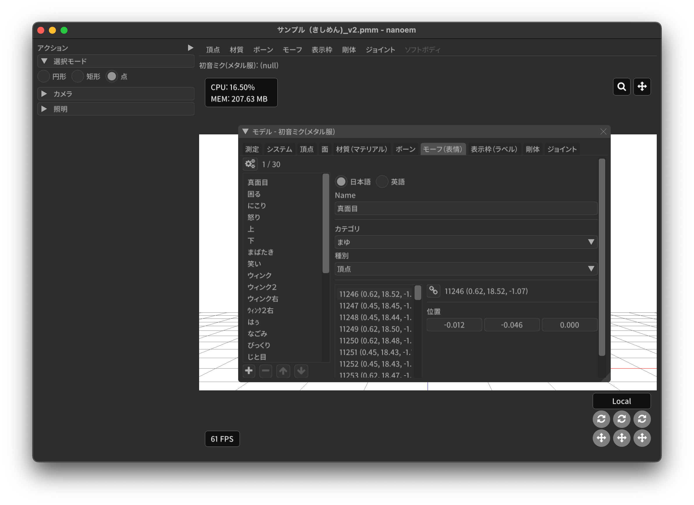

==========================================
モデル編集
==========================================

.. important::
   メニューの「:ref:`5A6CDB09-18D8-4D55-9D35-6FEF0A0B62FF`」から開く必要があります。また「:doc:`preference`」から「:ref:`F517A3B9-3273-4FE3-BD1E-4EDA53843140`」に✅を入れる必要があります。

   モデル編集モードに切り替えるにはプロジェクトをあらかじめ保存する必要があります。また、モデル編集モードに入るとモデル編集中は編集対象のモデル及びプロジェクトの整合性のために以下の制約が入ります。

   * プロジェクトの再生ができない
   * キーフレーム登録処理がすべて無効
   * 編集対象以外のモデル及びアクセサリを非表示
   * 編集対象以外のモデル切り替え不可
   * モデルのポーズが読み込み直後の状態に設定
   * 物理演算を無効化
   * グリッドが非表示の場合は表示
   * 「:ref:`D1BF8CFD-152D-4D1C-8B23-1FC6A4EBF391`」を強制的に無効化
   * モーションプラグイン利用不可

     * 33.0 現在では別の問題でモデルプラグインも利用不可ですがこの制約は緩和する予定です

   モデル編集ウィンドウを閉じると編集前の状態に戻ります。この時編集されたモデルが直接反映され、
   モデル編集前のデータのコピーがモデル名にモデル編集モードに切り替えた日時を追加したファイル名で保存されます。
   これは編集モード中からアプリケーション終了（ただしクラッシュによる強制終了は除く）する場合でも同様に行われます。

モデルのパラメータをいじったりオブジェクトの追加削除を行うための画面です。

モデル編集パネルはモデルオブジェクト種別をタブ毎に分かれ、さらに左側にモデルオブジェクト一覧、右側にパラメータ編集画面となっています。

モデルオブジェクト一覧には名前の左側に表示マスキング用途のチェックボックスがあり、✅状態でモデル編集モードにおいて選択可能になります。
逆に外れている場合は選択できません。うまく利用することで特定のモデルオブジェクトだけ選択することが容易になります。

.. note::
   マスキング用途のチェックボックスは「モーフ」及び「表示枠」にはありません。

画面左下のアイコンセットは新規追加及び削除、オブジェクトの移動が可能です。

- プラスアイコンはオブジェクトの追加を担当
- マイナスアイコンはオブジェクトの削除を担当

  - 単一オブジェクトのみが削除可能です
  - 上記により複数選択の場合は無効になります

- 上アイコンはオブジェクトを上に移動させる

  - オブジェクトが最上位にいる場合は無効になります
  - 複数選択の場合も無効になります

- 下アイコンはオブジェクトを下に移動させる

  - オブジェクトが最下位にいる場合は無効になります
  - 複数選択の場合も無効になります

- 頂点と面のパネルにはアイコンセットが存在しない

パラメータ編集画面左上のギアアイコンとして表示される「利用可能なアクション」は以下を共通点としてもちます。

- 選択対象がすでに選択されている場合は選択状態を維持する
- 選択状態を解除するときすでに解除している場合は解除状態を維持する
- 特定のオブジェクトに対して選択するアクションを実行するときは一回全て選択状態を解除する

  - 🎯（ダーツの的）がついてるものが対象
  - Shift キーを押している場合は選択状態を解除せず選択オブジェクトを追加することができる

モデルオブジェクトを複数選択すると一括編集画面に切り替わりモデルオブジェクトの一括編集が可能です。

- インデックス順で一番最初のモデルオブジェクトのパラメータが設定されます

  - パラメータの設定元となるモデルオブジェクトを選択することが可能です
  - 設定元のモデルオブジェクトを変更するとパラメータが上書きされるので注意が必要です

- 一括編集はフォーム上の全てのパラメータが適用されます。部分的な変更はできません
- 名前やテクスチャ、モーフ内のモデルオブジェクトの一括変更はできません

（モデル編集モード）
******************************************

アクション
==========================================

カメラ
------------------------------------------

カメラモードに切り替えます。

選択 > 頂点
----------------------------------------------------------------------

頂点の選択モードに設定します。

設定すると頂点が青い点で表示され、選択された頂点は赤い点で表示されます。
選択基準は頂点の原点座標が選択範囲に含まれるかどうかで判定されます。

選択 > 面
----------------------------------------------------------------------

面の選択モードに設定します。

設定すると辺が黒い線で表示され、選択された面は赤い線で表示されます。
選択基準は面の中心座標が選択範囲に含まれるかどうかで判定されます。

選択 > 材質
----------------------------------------------------------------------

材質の選択モードに設定します。

選択基準は材質の中心座標が選択範囲に含まれるかどうかで判定されます。

選択 > ボーン
----------------------------------------------------------------------

ボーンの選択モードに設定します。

設定すると不可視のボーンを含めたすべてのボーンが表示され、選択されたボーンは赤い点で表示されます。
選択基準はボーンの原点座標が選択範囲に含まれるかどうかで判定されます。

選択 > 剛体
----------------------------------------------------------------------

剛体の選択モードに設定します。

選択すると剛体の形状種別に応じて描画され、選択された剛体は赤く表示されます。
選択基準は剛体の原点座標が選択範囲に含まれるかどうかで判定されます。

選択 > ジョイント
----------------------------------------------------------------------

ジョイントの選択モードに設定します。

選択するとジョイントの中心が黄色で表示され、選択されたジョイントは赤く表示されます。
選択基準はジョイントの原点座標が選択範囲に含まれるかどうかで判定されます。

親ボーンの作成
------------------------------------------

ボーンをドラッグする形で親ボーンを作成します。

表示先ボーンの作成
------------------------------------------

ボーンをドラッグする形で表示先ボーンを作成します。

頂点ウェイトを塗る
------------------------------------------

頂点ウェイトペイントモードに切り替えます。

材質プリミティブの作成
------------------------------------------

以下の形状から頂点及び面を含めて新規材質として作成し追加します。

- 円錐
- 立方体
- 円筒
- 球体
- トーラス

作成時にパラメータ設定のダイアログが表示されます。OK をクリックすると作成されます。

.. csv-table::
   
   項目,説明
   移動量,形状の移動量を設定します
   回転量,形状の回転量を設定します
   スケール,形状の大きさを設定します
   円周分割数,円周部分の分割数を設定します [#f1]_
   高さ分割数,高さの分割数を設定します [#f1]_
   内径,トーラスの穴の部分の内径を設定します [#f2]_

選択
==========================================

.. note::
   アクションの「選択」のいずれかを設定すると表示されます。

モデルオブジェクトの選択で利用するモードを選択します。

円形
------------------------------------------

円形の範囲内にあるモデルオブジェクトを選択するモードにします。

矩形
------------------------------------------

矩形の範囲内にあるモデルオブジェクトを選択するモードにします。

ギズモ
==========================================

.. note::
   アクションの「選択」のいずれかを設定し、モデルオブジェクトがひとつ以上選択されている場合に表示されます。

.. caution::
   ギズモはボーン移動または回転で使われるハンドルとは別物です。そのため動作も異なります。

モデルオブジェクトの操作で使うギズモのモード変更を行います。

移動
----------------------------------------------------------------------

ギズモを移動モードに設定します。

移動モードは選択されたモデルオブジェクトを一括で移動させることができます。

回転
----------------------------------------------------------------------

ギズモを回転モードに設定します。

回転モードは選択されたモデルオブジェクトを一括で回転させることができます。

スケール
----------------------------------------------------------------------

ギズモをスケールモードに設定します。

スケールモードは選択されたモデルオブジェクトを一括で拡大あるいは縮小させることができます。

グローバル
----------------------------------------------------------------------

ギズモの移動及び回転方向をグローバルに設定します。

ローカル
----------------------------------------------------------------------

ギズモの移動及び回転方向をローカルに設定します。

頂点ウェイトペイント
==========================================

.. note::
   アクションの「頂点ウェイトを塗る」を設定すると表示されます。

ボーン
----------------------------------------------------------------------

頂点ウェイトペイントの対象となるボーンを設定します。

半径
----------------------------------------------------------------------

ブラシの半径を設定します。

差分
----------------------------------------------------------------------

ブラシで塗った箇所に対するウェイトの加算差分を設定します。

通常はウェイトを増やす挙動になりますが、マイナスに設定してウェイトを減らすことも可能です。

自動正規化
----------------------------------------------------------------------

頂点のウェイトが 1.0 以下になるように調整するかどうかを設定します。

カメラ
==========================================

以下のパラメータを設定できます。これらのパラメータはモデル編集時でのみ有効です。

- 注視点
- 角度
- 視野距離
- 視野角
- パースペクティブ

照明
==========================================

以下のパラメータを設定できます。これらのパラメータはモデル編集時でのみ有効です。

- 色
- 方向

メニュー
******************************************

頂点
==========================================

選択 > 全ての頂点を選択
----------------------------------------------------------------------

全ての頂点を選択状態に設定します。

選択 > 選択された全ての頂点を解除
----------------------------------------------------------------------

選択された全ての頂点を選択状態を解除します。

選択 > 選択された頂点が含まれる面を選択 🎯
----------------------------------------------------------------------

選択された頂点に含まれる面をすべて選択状態にします。

選択 > 選択された頂点が含まれる材質を選択 🎯
----------------------------------------------------------------------

選択された頂点に含まれる材質をすべて選択状態にします。

選択 > 選択された頂点が含まれる頂点モーフを選択 🎯
----------------------------------------------------------------------

選択された頂点に含まれる頂点モーフをすべて選択状態にします。

選択 > 選択された頂点が含まれるテクスチャモーフを選択 🎯
----------------------------------------------------------------------

選択された頂点に含まれるテクスチャモーフをすべて選択状態にします。

選択 > 次の種類に該当する頂点を選択 🎯
----------------------------------------------------------------------

以下の頂点種別に該当する全ての頂点を選択状態に設定します。

- BDEF1
- BDEF2
- BDEF4
- SDEF
- QDEF

マスキング > 選択された全ての頂点をマスキング
----------------------------------------------------------------------

選択された頂点をマスキングします。

マスキング > 選択された全ての頂点のマスキングを解除
----------------------------------------------------------------------

選択された全ての頂点をマスキング状態を解除します。

マスキング > 選択された面が含まれる材質を選択 🎯
----------------------------------------------------------------------

選択された面に含まれる材質をすべて選択状態にします。

マスキング > 全ての頂点のマスキング状態を反転
----------------------------------------------------------------------

全ての頂点のマスキング状態を反転します。

ボーン > 選択された頂点の中心にボーンを追加
----------------------------------------------------------------------

選択された頂点の中心点にボーンを追加します。

ボーンの位置が選択された頂点の中心点にあること以外は「新規ボーン作成」と同じです。

モーフ > 選択された頂点を頂点モーフに追加
----------------------------------------------------------------------

選択された頂点を指定した頂点モーフに追加します。頂点モーフが一つもない場合は実行できません。

モーフ > 選択された頂点をテクスチャモーフに追加
----------------------------------------------------------------------

選択された頂点を指定したテクスチャモーフに追加します。頂点モーフが一つもない場合は実行できません。

ウェイト転送 > ファイルから読み込み
----------------------------------------------------------------------

.. caution::
   ファイル仕様上 QDEF で設定された頂点情報を復元することができません（BDEF4 として設定されます）

   また「`PMXEditor ウェイト転送プラグイン <https://bowlroll.net/file/375>`_」の読み込み処理と異なり、最も近い頂点であっても明らかに離れている場合はスキップします

ウェイト転送で保存したファイルを読み込み、最も近い頂点に対して以下を再設定します。

- 位置
- 法線
- 設定されているボーン名
- ボーンウェイト
- SDEF 情報

ウェイト転送 > ファイルに保存
----------------------------------------------------------------------

選択されている頂点（頂点が一切選択されていない場合は全ての頂点）の以下の情報を保存します。これらの情報は「`PMXEditor ウェイト転送プラグイン <https://bowlroll.net/file/375>`_」で出力されるものと互換性があります。

- 位置
- 法線
- 設定されているボーン名
- ボーンウェイト
- SDEF 情報

面
=========================================

選択 > 全ての面を選択
----------------------------------------------------------------------

全ての面を選択状態に設定します。

選択 > 選択された全ての面を解除
----------------------------------------------------------------------

選択された全ての面を選択状態を解除します。

マスキング > 選択された全ての面をマスキング
----------------------------------------------------------------------

選択された面をマスキングします。

マスキング > 選択された全ての面のマスキングを解除
----------------------------------------------------------------------

選択された全ての面をマスキング状態を解除します。

マスキング > 全ての面のマスキング状態を反転
----------------------------------------------------------------------

全ての面のマスキング状態を反転します。

材質
==========================================

選択 > 全ての材質を選択
----------------------------------------------------------------------

全ての材質を選択状態に設定します。

選択 > 選択された全ての材質を解除
----------------------------------------------------------------------

選択された全ての材質を選択状態を解除します。

選択 > 選択された材質に含まれる全てのボーンを選択する 🎯
----------------------------------------------------------------------

選択された材質に含まれるボーン（厳密には面と頂点を経由した上で頂点に設定されているボーン）をすべて選択状態にします。

選択 > 選択された材質に含まれる全ての面を選択する 🎯
----------------------------------------------------------------------

選択された材質に含まれる面をすべて選択状態にします。

選択 > 選択された材質に含まれる全ての頂点を選択する 🎯
----------------------------------------------------------------------

選択された材質に含まれる頂点（面を経由）をすべて選択状態にします。

マスキング > 選択された全ての材質をマスキング
----------------------------------------------------------------------

選択された材質をマスキングします。

マスキング > 選択された全ての材質のマスキングを解除
----------------------------------------------------------------------

選択された全ての材質をマスキング状態を解除します。

マスキング > 全ての材質のマスキング状態を反転
----------------------------------------------------------------------

全ての材質のマスキング状態を反転します。

マスキング > 選択された材質を材質モーフに追加
----------------------------------------------------------------------

選択された材質を指定した材質モーフに追加します。材質モーフが一つもない場合は実行できません。

材質をマージする
----------------------------------------------------------------------

選択された材質をひとつ上にある材質にまとめます。選択された材質が最初にある場合は実行できません。

次のモデルにある材質からコピーする
----------------------------------------------------------------------

プロジェクト内にある編集中のモデル以外のモデルにある材質を指定して材質をコピーして追加します。

コピーされた材質は編集中のモデルの材質の末尾に追加されます。

ファイル (.obj) から材質を作成する
----------------------------------------------------------------------

ファイル（ ``.obj`` 形式のみ）を材質として作成して追加します。

* 頂点、法線、テクスチャ座標、頂点のインデックスがコピーされます
* 複数の形状があってもひとつの材質としてまとめられます
* ``obj`` ファイルに設定された材質設定は無視されます

大きさを変えたい場合は一回実行した後対象の材質を選択してギズモのスケールを選択して拡大あるいは縮小を行ってください。

ボーン
==========================================

選択 > 全てのボーンを選択
----------------------------------------------------------------------

全てのボーンを選択状態に設定します。

選択 > 選択された全てのボーンを解除
----------------------------------------------------------------------

選択された全てのボーンを選択状態を解除します。

選択 > 選択されたボーンが含まれる頂点を選択 🎯
----------------------------------------------------------------------

選択されたボーンに含まれる頂点をすべて選択状態にします。

選択 > 選択されたボーンが含まれるモーフを選択 🎯
----------------------------------------------------------------------

選択されたボーンに含まれるモーフをすべて選択状態にします。

選択 > 選択されたボーンが含まれる剛体を選択 🎯
----------------------------------------------------------------------

選択されたボーンに含まれる剛体をすべて選択状態にします。

選択 > 全ての表示ボーンを選択 🎯
----------------------------------------------------------------------

「表示」が有効な全てのボーンを選択状態に設定します。

選択 > 全ての移動可能ボーンを選択 🎯
----------------------------------------------------------------------

「回転可能」設定が有効な全てのボーンを選択状態に設定します。

選択 > 全ての移動可能ボーンを選択 🎯
----------------------------------------------------------------------

「移動可能」設定が有効な全てのボーンを選択状態に設定します。

選択 > 左右対称のボーンを選択
----------------------------------------------------------------------

選択されているボーンのうち名前の先頭が「右」の場合「左」を、「左」の場合「右」のボーンを選択状態に設定します。

この選択処理は常に追加の選択処理として行われます。

マスキング > 選択された全てのボーンをマスキング
----------------------------------------------------------------------

選択されたボーンをマスキングします。

マスキング > 選択された全てのボーンのマスキングを解除
----------------------------------------------------------------------

選択された全てのボーンをマスキング状態を解除します。

マスキング > 全てのボーンのマスキング状態を反転
----------------------------------------------------------------------

全てのボーンのマスキング状態を反転します。

ボーン > 選択されたボーンを IK ボーンに追加
----------------------------------------------------------------------

選択されたボーンを指定した IK の IK リンクとして追加します。

表示枠 > 選択されたボーンを表示枠に追加
----------------------------------------------------------------------

選択されたボーンを指定した表示枠に追加します。予約枠への追加はできません。

モーフ > 選択されたボーンをボーンモーフに追加
----------------------------------------------------------------------

選択されたボーンを指定したボーンモーフに追加します。ボーンモーフが一つもない場合は実行できません。

新規追加
----------------------------------------------------------------------

ボーンを新規に作成して以下のどちらかに追加します。

* 最後尾
* 選択したオブジェクトの後ろ

コピーを追加
----------------------------------------------------------------------

選択されたボーンの複製を以下のどちらかに追加します。

* 最後尾
* 選択したオブジェクトの後ろ

接続先ボーンを作成
----------------------------------------------------------------------

選択されたボーンの複製を接続先ボーンとして作成して追加します。

* ボーン名に日本語の場合は「先」を、英語の場合は ``D`` を追加
* 作成される接続先ボーンの親は作成時に選択されたボーン

多段ボーンを作成
----------------------------------------------------------------------

多段ボーンを作成します。親と子の二種類があり、それぞれ違いがありますが選択されたボーンをコピーする点は共通です。

* 親

  * 選択されたボーンを親として、作成される多段ボーンを子として作成する
  * 作成される前に選択されたボーンが親だった場合は多段ボーンに置き換えられる
  * ボーン名に ``+`` が追加される
  * 「:ref:`CCDE11E1-3416-425D-80DF-A347F79E7BDD`」で作成される「グルーブ」の作成処理は「センター」に対してこの処理を適用したものと基本原理は同じ

* 子

  * 選択されたボーンを子として、作成される多段ボーンを親として作成する
  * 選択されたボーンの親が多段ボーンに置き換えられ、親の情報が多段ボーンに引き継がれる
  * ボーン名に ``-`` が追加される

ボーン（軸設定用）
==========================================

以下のプロパティが設定されている場合にのみ利用可能なメニューです

* 固定軸
* ローカル軸

親ボーンから設定
------------------------------------------

現在のボーンから親ボーンまでのベクトルを正規化したものを軸として設定します。親ボーンがない場合は利用できません。

接続先から設定
------------------------------------------

現在のボーンから接続先ボーンあるいは接続先原点までのベクトルを正規化したものを軸として設定します。

次のボーンから設定
------------------------------------------

現在のボーンから選択されたボーンまでのベクトルを正規化したものを軸として設定します。

次の方向のグローバル軸から設定
------------------------------------------

グローバル軸の固定値を設定します。

.. csv-table::

   X,1/0/0
   Y,0/1/0
   Z,0/0/1

モーフ
==========================================

選択 > 全てのモーフを選択
----------------------------------------------------------------------

全てのモーフを選択状態に設定します。

選択 > 選択された全てのモーフを解除
----------------------------------------------------------------------

選択された全てのモーフを選択状態を解除します。

選択 > 選択されたモーフから該当する全てのモデルオブジェクトを選択 🎯
----------------------------------------------------------------------

選択されたモーフの種別に応じて該当する全てのモデルオブジェクトを選択状態に設定します。

表示枠 > 選択されたモーフを表示枠に追加
----------------------------------------------------------------------

選択されたモーフを指定した表示枠に追加します。

モーフ > 選択されたモーフをグループモーフに追加
----------------------------------------------------------------------

選択されたモーフを指定したグループモーフに追加します。グループモーフが一つもない場合は実行できません。

モーフ > 選択されたモーフをフリップモーフに追加
----------------------------------------------------------------------

選択されたモーフを指定したフリップモーフに追加します。モデルのバージョンが 2.1 未満あるいはフリップモーフが一つもない場合は実行できません。

新規追加
----------------------------------------------------------------------

モーフを新規に作成して以下のどちらかに追加します。

* 最後尾
* 選択したオブジェクトの後ろ

コピーを追加
----------------------------------------------------------------------

選択されたモーフの複製を以下のどちらかに追加します。

* 最後尾
* 選択したオブジェクトの後ろ

ポーズファイルからボーンモーフを作成
----------------------------------------------------------------------

``vpd`` 形式のポーズファイルから編集中のモデルに存在するボーンの差分をとって差分が存在するものをボーンモーフとして作成します。

作成されるボーンモーフの名前はポーズファイル名で作成されます。

モデルファイルから頂点モーフを作成
----------------------------------------------------------------------

モデルファイルから編集中のモデルと一致する頂点の差分をとって差分が存在するものを頂点モーフとして作成します。編集中のモデルと読み込まれるモデルの頂点数は必ず一致させる必要があります。

作成される頂点モーフの名前はモデルファイル名で作成されます。

表示枠
==========================================

選択 > 全ての表示枠を選択
----------------------------------------------------------------------

全ての表示枠を選択状態に設定します。

選択 > 選択された全ての表示枠を解除
----------------------------------------------------------------------

選択された全ての表示枠を選択状態を解除します。

選択 > 選択された表示枠から該当するボーンまたはモーフを選択
----------------------------------------------------------------------

選択された表示枠に含まれるボーンあるいはモーフを選択状態に設定します。

剛体
==========================================

選択 > 全ての剛体を選択
----------------------------------------------------------------------

全ての剛体を選択状態に設定します。

選択 > 選択された全ての剛体を解除
----------------------------------------------------------------------

選択された全ての剛体を選択状態を解除します。

選択 > 選択された剛体から該当する全てのボーンを選択 🎯
----------------------------------------------------------------------

選択された剛体に設定されているボーンを全て選択状態に設定します。

選択 > 左右対称の剛体を選択
----------------------------------------------------------------------

選択されている剛体のうち名前の先頭が「右」の場合「左」を、「左」の場合「右」の剛体を選択状態に設定します。

この選択処理は常に追加の選択処理として行われます。

マスキング > 選択された全ての剛体をマスキング
----------------------------------------------------------------------

選択された剛体をマスキングします。

マスキング > 選択された全ての剛体のマスキングを解除
----------------------------------------------------------------------

選択された全ての剛体をマスキング状態を解除します。

マスキング > 全ての剛体のマスキング状態を反転
----------------------------------------------------------------------

全ての剛体のマスキング状態を反転します。

新規追加
----------------------------------------------------------------------

剛体を新規に作成して以下のどちらかに追加します。

* 最後尾
* 選択したオブジェクトの後ろ

ふたつの剛体から中間ジョイントを作成
----------------------------------------------------------------------

選択されたふたつの剛体の中間位置にジョイントを作成します。

作成されるジョイントは以下の条件で作成され、それ以外は初期値で設定されます。

* 名前は剛体Aとなる剛体の名前をコピー
* 位置は選択されたふたつの剛体の中間地点で設定
* ``6-DOF with Spring`` として設定
* 剛体Aはインデックス順で先に来る方
* 剛体Bはインデックス順で後に来る方

コピーを追加
----------------------------------------------------------------------

選択された剛体の複製を以下のどちらかに追加します。

* 最後尾
* 選択したオブジェクトの後ろ

ジョイント
==========================================

選択 > 全てのジョイントを選択
----------------------------------------------------------------------

全てのジョイントを選択状態に設定します。

選択 > 選択された全てのジョイントを解除
----------------------------------------------------------------------

選択された全てのジョイントを選択状態を解除します。

選択 > 選択されたジョイントから該当する全てのボーンを選択 🎯
----------------------------------------------------------------------

選択されたジョイントに設定されている剛体経由のボーンを全て選択状態に設定します。

選択 > 選択されたジョイントから該当する全ての剛体を選択 🎯
----------------------------------------------------------------------

選択されたジョイントに設定されている剛体を全て選択状態に設定します。

選択 > 左右対称のジョイントを選択
----------------------------------------------------------------------

選択されているジョイントのうち名前の先頭が「右」の場合「左」を、「左」の場合「右」のジョイントを選択状態に設定します。

この選択処理は常に追加の選択処理として行われます。

マスキング > 選択された全てのジョイントをマスキング
----------------------------------------------------------------------

選択されたジョイントをマスキングします。

マスキング > 選択された全てのジョイントのマスキングを解除
----------------------------------------------------------------------

選択された全てのジョイントをマスキング状態を解除します。

マスキング > 全てのジョイントのマスキング状態を反転
----------------------------------------------------------------------

全てのジョイントのマスキング状態を反転します。

新規追加
----------------------------------------------------------------------

剛体をジョイントに作成して以下のどちらかに追加します。

* 最後尾
* 選択したオブジェクトの後ろ

コピーを追加
----------------------------------------------------------------------

選択されたジョイントの複製を以下のどちらかに追加します。

* 最後尾
* 選択したオブジェクトの後ろ

ソフトボディ
==========================================

選択 > 全てのソフトボディを選択
----------------------------------------------------------------------

全てのソフトボディを選択状態に設定します。

選択 > 選択された全てのソフトボディを解除
----------------------------------------------------------------------

選択された全てのソフトボディを選択状態を解除します。

マスキング > 選択された全てのソフトボディをマスキング
----------------------------------------------------------------------

選択されたソフトボディをマスキングします。

マスキング > 選択された全てのソフトボディのマスキングを解除
----------------------------------------------------------------------

選択された全てのソフトボディをマスキング状態を解除します。

マスキング > 全てのソフトボディのマスキング状態を反転
----------------------------------------------------------------------

全てのソフトボディのマスキング状態を反転します。

新規追加
----------------------------------------------------------------------

ソフトボディを新規に作成して以下のどちらかに追加します。

* 最後尾
* 選択したオブジェクトの後ろ

コピーを追加
----------------------------------------------------------------------

選択されたソフトボディの複製を以下のどちらかに追加します。

* 最後尾
* 選択したオブジェクトの後ろ

測定タブ
******************************************

モデルの測定情報を表示します。以下の情報が左パネルに表示されます。

- 頂点数
- 面数
- 材質数
- テクスチャ数
- ボーン数
- IKボーン数
- モーフ数
- 表情枠数
- 剛体数
- ジョイント数
- ソフトボディ数

一括モデル変形
==========================================

.. note::
   一括モデル変形はモデルオブジェクトの位置情報のみ更新します。

モデルを「身長ベース」あるいは「数値入力」により指定された数値にしたがって一括に変形を行います。

身長ベース
------------------------------------------

「`身長158cmプラグイン <https://seiga.nicovideo.jp/seiga/im2597790>`_」とほぼ同等の処理を行います。

身長ベースの場合は「数値入力」の Scale を「拡大率」で適用したものと同じ処理を行います。

.. note::
   「A. MMD におけるモデルの身長」は全ての頂点位置のうち Y の最低値と最高値の差分をとった値で計算されます。

.. csv-table::

   A. MMD におけるモデルの身長,モデルの身長を MMD における表示単位で表示します。読み取り専用です。
   B. MMD におけるセンチメートル単位,MMD における表示単位をセンチメートル単位に変換した時の数値を指定します。
   C. 補正用途のセンチメートル,靴や帽子などによりかさ上げされる分を補正するためのセンチメートル単位の数値を指定します。
   センチメートル単位のモデルの身長 (A * B + C),計算した結果を表示します。この値を変更すると拡大率が変わります。
   拡大率,計算結果と変更した結果の拡大率の差分を表示します。

「センチメートル単位のモデルの身長」の値を変更したうえで「適用」するとモデル変形が実行されます。また「リセット」で初期値に戻すことができます。

数値入力
------------------------------------------

数値入力は入力された Translation/Rotation/Scale を行列に変換して一括適用する処理を実行します。

- Translation
- Rotation
- Scale

情報タブ
******************************************

.. image:: images/model/info_tab.png

名称
==========================================

モデル名を指定します。PMD の場合のみ２０バイトの文字制限があります。

コメント
==========================================

コメントの入力欄です。PMD の場合のみ２５６バイトの文字制限があります。

文字エンコード
==========================================

.. caution::
   MikuMikuDance では UTF-16 のみが利用可能です。PMD の場合は仕様上 ShiftJIS 固定です。

文字コードを以下から指定します

- UTF-16
- UTF-8

追加 UV 数
==========================================

.. note::
   追加 UV は基本的にエフェクトで使われます。頂点数に応じてモデルのファイルサイズが肥大化するので必要な場合にのみ入れてください。

   材質に頂点色あるいはスフィアマップのサブテクスチャが有効の場合は拡張 UV のうち 1 番目が利用されます。

頂点に付与する追加 UV 数を 0-4 の間で指定します。

頂点タブ
******************************************

.. image:: images/model/vertex_tab.png

頂点座標
==========================================

頂点の座標を指定します

法線座標
==========================================

.. warning::
   全て 0 にすると不正な法線になり描画異常をきたす恐れがあるので指定しないてください。

法線のベクトルを指定します

UV座標
==========================================

.. note::
   0 未満または 1 以上の場合はミラーリングされます

UV（テクスチャ）座標を指定します。テクスチャ座標は対応する材質のテクスチャでメッシュとして表示されます。

所属材質
==========================================

頂点が属している材質名が表示されます。左隣のリンクボタンで該当材質の編集画面に遷移します。

エッジ幅
==========================================

頂点単位のエッジ幅を指定します（PMD の場合はエッジの有無のみが設定可能です）。

描画時は頂点のエッジ幅と材質のエッジ幅の乗算によりエッジ幅が決定されます。

頂点種別と影響ボーン
==========================================

.. caution::
   ボーンが未指定の場合は内部的にダミーボーンが設定されます。これはモデル描画を破綻させる原因になるため何らかのボーンを設定する必要があります。

頂点の変形方法を以下から指定します。ボーン選択左隣のリンクボタンで該当ボーンの編集画面に遷移します。

.. csv-table::

   種別,変形方法,ボーン指定数,備考
   BDEF1,線形ブレンド,1,ウェイト固定
   BDEF2,線形ブレンド,2,PMD はこの形式のみ対応かつ％単位設定
   BDEF4,線形ブレンド,4,ウェイトの合計が 1.0 を超える場合は自動的に正規化
   SDEF,球形ブレンド,2,MMD 特有で実装によって変形が変わる可能性あり
   QDEF,デュアルクォータニオン,4,ウェイトの取り扱いは BDEF4 と同じ、MMD 未対応

SDEF を指定した場合は以下の項目が追加されます

- C
- R0
- R1

面タブ
******************************************

.. image:: images/model/face_tab.png

材質タブ
******************************************

.. image:: images/model/material_tab.png

画面右側の材質一覧にあるチェックボックスで材質単位で表示非表示の切り替えが可能です。

名称
==========================================

.. note::
   PMD は仕様上材質名を持つことができないため便宜上の名前が設定されます。

材質名を指定します

環境光色（アンビエント）
==========================================

.. important::
   材質の基本色は以下の計算式で決定されます。

       ``環境光色`` + ``拡散色`` * ``照明色`` + ``鏡面光色`` * ``計算済みの反射強度``

照明が当たらないときの色を指定します。

拡散色（ディフューズ）
==========================================

照明に当たった時の色を指定します。透明度の指定が可能です。

鏡面光色（スペキュラー）
==========================================

反射した時の色を指定します。

鏡面光色の強度
==========================================

反射強度を設定します。0 の場合は鏡面光の計算自体がスキップされます。

エッジ色
==========================================

エッジ色を指定します。透明度は「エッジ色の透明度」で別途指定します。

エッジ色の透明度
==========================================

エッジの透明度を指定します。

エッジ幅
==========================================

エッジの幅（太さ）を指定します。

描画時は頂点のエッジ幅と材質のエッジ幅の乗算によりエッジ幅が決定されます。

プリミティブ種別
==========================================

.. caution::
   三角以外は PMX 2.1 から導入されたもののため MikuMikuDance では利用できません。

描画プリミティブを以下から指定します

- 三角（トライアングル）
- 線（ライン）
- 点（ポイント）

スフィアマップ種別
==========================================

.. caution::
   サブテクスチャは頂点カラーと混在することができません。

スフィアマップの種別を指定します。サブテクスチャを利用する場合のみ拡張 UV1 が利用されます。

- なし
- 乗算
- 加算
- サブテクスチャ

テクスチャ
==========================================

.. note::
   モデルのテクスチャで利用可能な拡張子は以下の通りです。

   * png
   * jpg
   * bmp
   * tga

   PMD の場合のみパス名に対して２０バイトの制限があります。

歯車アイコンをクリックするとメニューが表示され以下の処理を行うことが出来ます

.. csv-table::

   項目,説明
   拡散光テクスチャを設定,拡散光テクスチャをファイルから読み込んで設定します
   スフィアマップテクスチャを設定,スフィアマップテクスチャをファイルから読み込んで設定します
   トゥーンテクスチャを設定,トゥーンテクスチャをファイルから読み込んで設定します
   拡散光テクスチャをクリア,拡散光テクスチャを無効にします
   スフィアマップテクスチャをクリア,スフィアマップテクスチャを無効にします
   トゥーンテクスチャをクリア,トゥーンテクスチャを無効にします

拡散光テクスチャ
------------------------------------------

拡散光テクスチャの中身を表示します。

「UV メッシュを表示する」を有効にすると材質に対応する頂点のテクスチャ座標のメッシュが表示されます。

スフィアマップテクスチャ
------------------------------------------

スフィアマップテクスチャの中身を表示します。

「UV メッシュを表示する」を有効にすると材質に対応する頂点の法線のメッシュが表示されます。

トゥーンテクスチャ
------------------------------------------

トゥーンテクスチャの中身を表示します。

カリング無効（両面描画）
==========================================

.. tip::
   両面描画は描画処理速度が影響が出るため、裏面を描画する必要がない不透明な材質の場合はチェックを外したままにしましょう。

カリングを無効にするかどうかを指定します。無効にした場合は両面描画されます。

地面影の投影対象
==========================================

地面影の投影対象にするかどうかを指定します。

スカイドームなどのオブジェクトを覆う系の材質を投影対象から外したいときに使います。

セルフシャドウの投影対象
==========================================

セルフシャドウの投影対象にするかどうかを指定します。内部的にはセルフシャドウマップテクスチャへの描画判定に利用されます。

利用想定は「地面影の投影対象」と同じです。

セルフシャドウ
==========================================

セルフシャドウの投影結果を反映して描画するかどうかを指定します。

セルフシャドウによる影を落としたくない用途で外したいときに使います。

エッジ
==========================================

エッジの描画対象とするかどうかを指定します。この設定が無効になっている場合はエッジの描画がされなくなるためエッジ設定がすべて無視されます。

頂点カラー
==========================================

.. caution::
   PMX 2.1 から導入されたもののため MikuMikuDance では利用できません。またそれ故にエフェクト側の対応が皆無であるため利用機会は少ないかもしれません。

   PMX の仕様上、頂点カラーはサブテクスチャと混在することができません。

頂点カラーを使用するかどうかを指定します。頂点カラーを利用する場合は拡張 UV の1番目が頂点の色として利用されます。

ボーンタブ
******************************************

.. image:: images/model/bone_tab.png

名称
==========================================

.. important::
   ボーン名は VMD の仕様のため出来る限り７文字以内（厳密には１５バイト以内）収めてください。これを超えると VMD 読み込み時にボーン変形が正しく適用されない問題が発生します。
   ただし利用者が操作しないボーン、例えばボーン表示先などは変形させて保存しない限りは問題ありません。また NMD のみ利用する場合は文字制限を気にする必要はありません。

   ボーン名はモーションの挙動にも関わるためモデルのボーン全体で一意になるようにして重複させないようにしてください。

   これらの問題は「:ref:`D102480C-FFFB-43BA-9561-291E1AF4255B`」を利用することで検出することができます。

ボーン名を指定します。PMD の場合のみ２０バイトの制限があります。

原点座標
==========================================

ボーンの原点座標を指定します。

ボーン変形においてローカル座標を求める基準となります。

親ボーン
==========================================

親ボーンを指定します。親ボーンを指定すると親ボーンの変形に連動する形となります。

親ボーンが指定されており、かつ該当ボーンが親ボーンより先に変形される状態の場合は異常を示すために文字色が白色から黄色に変わります。
詳細は「:ref:`3BAF6B87-F383-4423-955E-AC3670F76BDE`」を参照してください。

接続先ボーン
==========================================

「接続先ボーン」が指定されている場合の接続先ボーンを指定します。

接続先原点座標
==========================================

「接続先原点座標」が指定されている場合の接続先ボーンの原点座標を指定します。

.. _3BAF6B87-F383-4423-955E-AC3670F76BDE:

変形階層
==========================================

.. note::
   ボーン変形は以下の順番でソートしてから実行されます。

   * 「物理演算後計算の有無」

     * 物理演算後計算がない方を優先

   * 変形階層順

     * 変形階層の値が小さいほど優先

   * ボーン番号順

変形階層を指定します。変形順序を制御するために利用され、PMD からの変換で複数の IK が使われている場合において変形階層が予め指定されることがあります。

親ボーン系で文字が黄色く表示されている場合は以下の問題に該当している可能性があります。これは上記のボーン変形のソート仕様に基づいて行われてるため、
子ボーンが親ボーンより先に変形する逆転現象が発生し、親ボーンの変形を考慮せずに変形されてしまう問題が発生します。

* 親ボーンが「物理演算後計算」が「有効」かつ子ボーンが「物理演算後計算」が「無効」
* 親ボーンが子ボーンより前にあり、かつ親ボーンの変形階層の値が子ボーンより大きい
* 親ボーンが子ボーンより後にあり、かつ親ボーンの変形階層の値が子ボーンと同じか大きい

移動可能
==========================================

ボーンが移動可能かどうかを指定します。

有効にすることで以下に影響します。

.. note::
   これらの項目は「操作可能」が有効である必要があります。無効の場合は回転可能であっても一切の操作ができません。

- 「移動」が選択可能になりモデル上の移動ハンドルが表示される
- ビューポート右下の移動ハンドルが利用可能になる
- 移動パラメータが設定可能になる

回転可能
==========================================

ボーンが回転可能かどうかを指定します。

有効にすることで以下に影響します。

.. note::
    これらの項目は「操作可能」が有効である必要があります。無効の場合は回転可能であっても一切の操作ができません。

- 「回転」が選択可能になりモデル上の回転ハンドルが表示される
- ビューポート右下の回転ハンドルが利用可能になる
- 回転パラメータが設定可能になる

可視
==========================================

ボーンが可視であるかどうかを指定します。

有効にすることで以下に影響します。

- ボーン接続表示
- ポーズファイル書き出し時に保存対象となる

「操作可能」が無効の場合はボーン接続表示されるのみで一切の操作できません。また、可視状態に関わらずラベルに追加しない限りタイムラインのトラックに表示されません。

不可視ボーンはボーン編集時にのみ表示されます。その際はグレーで表示されます。

操作可能
==========================================

ボーンが操作可能かどうかを指定します。

有効にすることで以下のふたつに影響します。通常は「可視」と併用で利用します。

- 「移動可能」の有効で移動ハンドルが表示される
- 「回転可能」の有効で回転ハンドルが表示される

IK 制約
==========================================

ボーンが IK 制約を持つかどうかを指定します。

ボーン接続表示において黄色で表示されます。

エフェクター（作用）ボーン
----------------------------------------------------------------------

IK の起点となるボーンを指定します。これは利用者が直接操作するボーンになります。

ターゲット（終点）ボーン
----------------------------------------------------------------------

IK の終点となるボーンを指定します。

角度
----------------------------------------------------------------------

IK リンクボーンにおいて動かせる角度を指定します。

IK リンクボーン
----------------------------------------------------------------------

起点と終点の間につながるボーンを指定します。

試行回数
----------------------------------------------------------------------

.. note::
   IK の仕組み上エフェクターボーンが極端な位置にあると位置を正しく決定することができなくなるため、試行回数に関わらず不安定になります。

IK の試行回数を指定します。

試行回数は多いほど安定度をあげますが処理負荷が大きくなります。一方で少ないほど処理負荷が小さくなりますが不安定になります。

移動付与
==========================================

ボーンに移動付与をつけるかどうかを指定します。

移動付与は親ボーンが移動したとき該当ボーンを親ボーンと同じ移動量で追従する仕組みです。移動量は付与率によって変えることができます。

付与親ボーン
----------------------------------------------------------------------

連動する付与親ボーンを指定します。

該当ボーンが付与親ボーンより先に変形される状態の場合は異常を示すために文字色が白色から黄色に変わります。
詳細は「:ref:`3BAF6B87-F383-4423-955E-AC3670F76BDE`」を参照してください。

付与率
----------------------------------------------------------------------

割合を指定します。 1.0 の場合は親ボーンと同じ移動量が適用されます。マイナスを指定すると動きをキャンセルする使い方が可能になります。

回転付与
==========================================

ボーンに回転付与をつけるかどうかを指定します。

回転付与は親ボーンが回転したとき該当ボーンを親ボーンと同じ回転量で追従する仕組みです。回転量は付与率によって変えることができます。
また親ボーンを IK リンクに設定しその IK リンクによって自動的に回転量が設定された場合も適用されます。

親ボーン
----------------------------------------------------------------------

連動する親ボーン（付与親）を指定します。

付与率
----------------------------------------------------------------------

割合を指定します。 1.0 の場合は親ボーンと同じ移動量が適用されます。マイナスを指定すると動きをキャンセルする使い方が可能になります。

固定軸
==========================================

ボーンに固定軸を持つかを指定します。

固定軸を設定するとグローバル及びローカル関係なく指定された軸に沿う形で変形します。また IK にも角度制限よりも優先的に適用されます。

ボーン接続表示において紫色で表示されます。またビューポート右下のハンドルから操作された時軸は表示されません。

固定軸
----------------------------------------------------------------------

.. caution::
   すべて 0 に設定すると不正な軸になりボーン操作時に異常な動きを起こす原因になるため設定しないようにしてください。

固定軸のベクトル値を指定します

ローカル軸
==========================================

ボーンにローカル軸を持つかを指定します。

.. note::
   ローカル軸は X 軸及び Z 軸のベクトルから Y 軸を計算し、直交になるように自動的に計算されます。そのため、Y 軸の設定項目はありません。

   親ボーンに「右腕」または「左腕」が含まれている場合はローカル軸を設定しなくても自動的にローカル軸が設定されます。なおローカル軸がすでに設定されている場合はそちらを優先します。

ローカル軸を設定すると変形方法がローカルの場合においてビューポート右下のハンドルから操作された時に指定された軸に沿う形で変形します（グローバル時は適用しない）。

X軸
----------------------------------------------------------------------

.. caution::
   すべて 0 に設定すると不正な軸になりボーン操作時に異常な動きを起こす原因になるため設定しないようにしてください。

X軸方向のベクトル値を指定します

Z軸
----------------------------------------------------------------------

.. caution::
   すべて 0 に設定すると不正な軸になりボーン操作時に異常な動きを起こす原因になるため設定しないようにしてください。

Z軸方向のベクトル値を指定します

物理演算後計算
==========================================

ボーンの変形処理を物理演算処理のあとに実施するかどうかを指定します。

モーフタブ
******************************************

名称
==========================================

.. important::
   モーフ名は VMD の仕様のため出来る限り７文字以内（厳密には１５バイト以内）に収めてください。これを超えると VMD 読み込み時にモーフ変形が正しく適用されない問題が発生します。
   ただし NMD のみ利用する場合は文字制限を気にする必要はありません。

   モーフ名はモーションの挙動にも関わるためモデルのモーフ全体で一意になるようにして重複させないようにしてください。

   これらの問題は「:ref:`D102480C-FFFB-43BA-9561-291E1AF4255B`」を利用することで検出することができます。

モーフ名を指定します

カテゴリ
==========================================

カテゴリを以下から指定します。これは :ref:`D971D5DE-F7A7-4643-9A97-AFB7A8495649` において指定されたカテゴリに配置されます。

- 目
- まゆ
- リップ
- その他

種別
==========================================

.. caution::
   「フリップ」と「インパルス」は PMX 2.1 から導入されたもののため MikuMikuDance では利用できません。
   また PMD では頂点モーフのみが利用可能です。

種別を以下から指定します。

- ボーン
- フリップ
- グループ
- インパルス
- 材質
- テクスチャ
- 拡張 UV1
- 拡張 UV2
- 拡張 UV3
- 拡張 UV4
- 頂点

ボーン
----------------------------------------------------------------------

ボーンモーフは複数のボーンを一括変形して処理するモーフです。

.. csv-table::

   項目,説明
   ボーン,対象ボーンを設定します
   移動,ウェイト最大時の移動量を設定します
   回転,ウェイト最大時の回転量を設定します

フリップ
----------------------------------------------------------------------

フリップモーフはウェイト値に応じて個々のモーフを固定のウェイト値で変形させるモーフです。
実質的に二値しか利用できないテクスチャあるいは拡張 UV モーフの組み合わせで利用します。

.. csv-table::

   項目,説明
   モーフ,対象モーフを設定します
   ウェイト,固定値のウェイトを設定します

グループ
----------------------------------------------------------------------

グループモーフは複数のモーフを指定したウェイト値で乗算して一括変形させるモーフです。

.. csv-table::

   項目,説明
   モーフ,対象モーフを設定します
   ウェイト,固定値のウェイトを設定します

インパルス
----------------------------------------------------------------------

インパルスモーフは剛体にトルク（力）とベロシティ（速度）を適用して加速度をつけるモーフです。特性上対象剛体は「ボーン連動」以外を利用する必要があります。

.. csv-table::

   項目,説明
   剛体,対象剛体を設定します
   トルク,ウェイト最大時のトルク（力）を設定します
   ベロシティ,ウェイト最大時のベロシティ（速度）を設定します
   ローカル軸,ローカル軸を利用するかどうかを設定します

材質
----------------------------------------------------------------------

材質モーフは複数材質の色情報を一括変形するモーフです。

.. csv-table::

   項目,説明
   材質,対象材質を設定します
   環境光色,ウェイト最大時の環境光色を設定します
   拡散光色,ウェイト最大時の拡散光色を設定します
   反射光色,ウェイト最大時の反射光色を設定します
   反射強度,ウェイト最大時の反射強度を設定します
   エッジ色,ウェイト最大時のエッジ色を設定します
   エッジ幅,ウェイト最大時のエッジ幅を設定します
   拡散テクスチャブレンド係数,ウェイト最大時の拡散テクスチャのブレンド係数を設定します
   スフィアマップテクスチャブレンド係数,ウェイト最大時のスフィアマップテクスチャのブレンド係数を設定します
   トゥーンテクスチャブレンド係数,ウェイト最大時のトゥーンテクスチャのブレンド係数を設定します

テクスチャ
----------------------------------------------------------------------

テクスチャモーフは複数頂点のテクスチャ座標を一括変形させるモーフです。

.. csv-table::

   項目,説明
   頂点,対象頂点を設定します
   テクスチャ座標,ウェイト最大時のテクスチャ座標を設定します

拡張 UV
----------------------------------------------------------------------

拡張 UV モーフは複数頂点の拡張 UV 座標を一括変形させるモーフです。

.. csv-table::

   項目,説明
   頂点,対象頂点を設定します
   拡散 UV 座標,ウェイト最大時の拡張 UV 座標を設定します

頂点
----------------------------------------------------------------------

頂点モーフは複数頂点の位置座標を一括変形させるモーフです。

.. csv-table::

   項目,説明
   頂点,対象頂点を設定します
   位置,ウェイト最大時の位置差分を設定します

表示枠（ラベル）タブ
******************************************

.. image:: images/model/label_tab.png

名称
==========================================

表示枠名を指定します。PMD の場合のみ５０バイトの制限があります。

剛体タブ
******************************************

名称
==========================================

剛体名を指定します。PMD の場合のみ２０バイトの制限があります。

接続ボーン
==========================================

剛体の接続先ボーンを指定します。これは「オブジェクト種別」によって動作が変わります。

.. csv-table::

   項目,説明
   演算結果を全て反映,物理演算の結果をボーン変形に適用
   回転のみ反映,物理演算の結果をボーン変形に適用
   ボーン連動,ボーン変形の結果を物理演算に適用

ボーン選択左隣のリンクボタンで該当ボーンの編集画面に遷移します。

オブジェクト種別
==========================================

剛体の動作種別を指定します。

.. csv-table::

   項目,説明
   演算結果を全て反映,物理演算の結果をボーンに反映させます
   回転のみ反映,物理演算の結果のうち回転のみをボーンに反映させます（移動は破棄）
   ボーン連動,物理演算の結果を使わず逆にボーン変形を物理演算に反映させます

ボーン連動のみボーン変形の結果を物理演算に反映させます。それ以外は物理演算の結果をボーン変形に反映させる仕組みのため、
仮にボーン変形があったとしても物理演算の結果に上書きされます。

形状種別
==========================================

剛体の形状を指定します。

- 箱
- カプセル
- 球体

原点座標
==========================================

剛体の原点座標を指定します。

回転
==========================================

剛体の回転角度を指定します

形状の大きさ
==========================================

「形状種別」で指定した形状の大きさを指定します。形状によって適用される値が変わります（✅ は適用される値）。

.. csv-table::

   項目,X,Y,Z
   箱,✅,✅,✅
   カプセル,✅,✅,
   球体,✅,,

質量
==========================================

剛体の質量を指定します。

移動減衰
==========================================

剛体の移動減衰を指定します。

回転減衰
==========================================

剛体の回転減衰を指定します。

摩擦係数
==========================================

剛体の摩擦係数を指定します。

反発係数
==========================================

剛体の反発係数を指定します。

ジョイントタブ
******************************************

.. image:: images/model/joint_tab.png

名称
==========================================

ジョイント名を指定します。PMD の場合のみ２０バイトの制限があります。

接続剛体 (A)
==========================================

ジョイントが接続する剛体を指定します。剛体選択左隣のリンクボタンで該当剛体の編集画面に遷移します。

接続剛体 (B)
==========================================

ジョイントが接続する剛体を指定します。剛体選択左隣のリンクボタンで該当剛体の編集画面に遷移します。

原点座標
==========================================

ジョイントの原点座標を指定します。

回転
==========================================

ジョイントの回転角度を指定します

移動上限
==========================================

ジョイントの移動上限を指定します。

移動下限
==========================================

ジョイントの移動下限を指定します。

移動剛性
==========================================

ジョイントの移動剛性を指定します。

回転上限
==========================================

ジョイントの回転上限を指定します。

回転下限
==========================================

ジョイントの回転下限を指定します。

回転剛性
==========================================

ジョイントの回転剛性を指定します。

ソフトボディタブ
******************************************

.. caution::
   PMX 2.1 から導入されたもののため MikuMikuDance では利用できません。

名称
==========================================

ソフトボディ名を指定します

材質
==========================================

ソフトボディに対応する材質を指定します。

形状種別
==========================================

- 三角メッシュ
- ロープ

エアロモデル種別
==========================================

合計質量
==========================================

衝突マージン
==========================================

衝突グループID
==========================================

衝突グループマスク
==========================================

クラスタ数
==========================================

クラスタを有効にする
==========================================

ソフトボディのパラメータ
==========================================

- Velocity Correction Factor
- Damping Coefficient
- Drag Coefficient
- Lift Coefficient
- Pressure Coefficient
- Volume Conversation Coefficient
- Dynamic Friction Coefficient
- Pose Matching Coefficient
- Rigid Contact Hardness
- Kinetic Contact Hardness
- Soft Contact Hardness
- Anchor Hardness
- Soft vs Kinetic Hardness
- Soft vs Rigid Hardness
- Soft vs Soft Hardness
- Soft vs Kinetic Impulse Split
- Soft vs Rigid Impulse Split
- Soft vs Soft Impulse Split
- Linear Stiffness Coefficient
- Angular Stiffness Coefficient
- Volume Stiffness Coefficient
- Bending Constraints Distance
- Velocity Solver Iterations
- Position Solver Iterations
- Drift Solver Iterations
- Cluster Solver Iterations
- Enable Bending Constraints
- Enable Randomize Constraints

.. [#f1] 円錐、円筒、球体、トーラスでのみ設定可能
.. [#f2] トーラスでのみ設定可能
