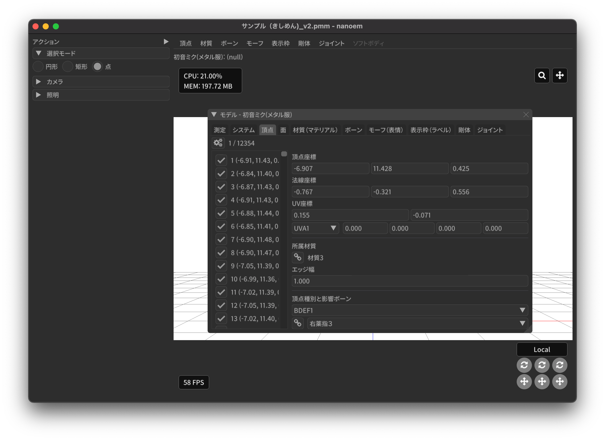
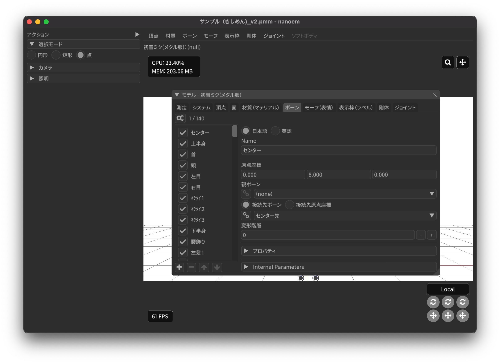

==========================================
モデル編集
==========================================

.. important::
   メニューの「:ref:`5A6CDB09-18D8-4D55-9D35-6FEF0A0B62FF`」から開く必要があります。また設定画面から「:ref:`F517A3B9-3273-4FE3-BD1E-4EDA53843140`」に✅を入れる必要があります

モデルのパラメータをいじったりオブジェクトの追加削除を行うための画面です。

情報タブ
******************************************

.. image:: images/model/info_tab.png

名称
==========================================

モデル名を指定します

コメント
==========================================

コメントの入力欄です

Encoding
==========================================

.. caution::
   UTF-8 は実装によって対応がまちまち（MikuMikuDance では UTF-16 のみ対応）なので UTF-16 を指定したほうが無難です。
   PMD の場合は仕様上 ShiftJIS 固定です。

文字コードを以下から指定します

- UTF-16
- UTF-8

UVA (拡張 UV)
==========================================

.. note::
   追加 UV は基本的にエフェクトで使われます。頂点数に応じてモデルのファイルサイズが肥大化するので利用する際はその点を念頭に入れてください。

   材質に頂点色が有効の場合は拡張 UV のうち 1 番目が利用されます。

頂点に付与する追加 UV 数を 0-4 の間で指定します

頂点タブ
******************************************

頂点座標
==========================================

頂点の座標を指定します

法線座標
==========================================

.. warning::
   全て 0 にすると不正な法線になり描画異常をきたす恐れがあるので指定しないてください

法線のベクトルを指定します

UV座標
==========================================

.. note::
   0 未満または 1 以上の場合はミラーリングされます

UV（テクスチャ）座標を指定します

エッジ幅
==========================================

頂点単位のエッジ幅を指定します（PMD の場合はエッジの有無のみが設定可能です）。

描画時は頂点のエッジ幅と材質のエッジ幅の乗算によりエッジ幅が決定されます。

頂点種別
==========================================

.. caution::
   ボーンが未指定の場合はダミーボーンが設定されます。これはモデル描画を破綻させる原因になるため何らかのボーンを設定する必要があります。

頂点の変形方法を以下から指定します

.. csv-table::

   種別,変形方法,ボーン指定数,備考
   BDEF1,線形ブレンド,1,ウェイト固定
   BDEF2,線形ブレンド,2,PMD はこの形式のみ対応
   BDEF4,線形ブレンド,4,ウェイトの合計が 1.0 を超える場合は自動的に正規化
   SDEF,球形ブレンド,2,MMD 特有で実装によって変形が変わる可能性あり
   QDEF,デュアルクォータニオン,4,ウェイトの取り扱いは BDEF4 と同じ、MMD 未対応

SDEF を指定した場合は以下の項目が追加されます

- C
- R0
- R1

面タブ
******************************************

.. image:: images/model/face_tab.png

材質タブ
******************************************

.. image:: images/model/material_tab.png

名称
==========================================

.. note::
   PMD は仕様上材質名を持つことができないため便宜上の名前が設定されます

材質名を指定します

環境光色（アンビエント）
==========================================

照明に依存しない色を指定します。

拡散色（ディフューズ）
==========================================

照明に当たった時の色を指定します。透明度の指定が可能です。

鏡面光色（スペキュラー）
==========================================

.. note::
   これは主にエフェクトで使われます。エフェクト未使用時のモデル描画において鏡面光色は利用されません

反射した時の色を指定します。

鏡面光色の強度
==========================================

反射強度を設定します。

エッジ色
==========================================

エッジ色を指定します。透明度は「エッジ色の透明度」で別途指定します。

エッジ色の透明度
==========================================

エッジの透明度を指定します。

エッジ幅
==========================================

エッジの幅（太さ）を指定します。

描画時は頂点のエッジ幅と材質のエッジ幅の乗算によりエッジ幅が決定されます。

Primitive Type
==========================================

.. caution::
   三角以外は PMX 2.1 から導入されたもののため MikuMikuDance では利用できません

描画プリミティブを以下から指定します

- 三角（トライアングル）
- 線（ライン）
- 点（ポイント）

SphereMap Type
==========================================

スフィアマップの種別を指定します。

- なし
- 乗算
- 加算
- サブテクスチャ

拡散光テクスチャ
==========================================

拡散光テクスチャの中身を表示します。

スフィアマップテクスチャ
==========================================

スフィアマップテクスチャの中身を表示します。

トゥーンテクスチャ
==========================================

トゥーンテクスチャの中身を表示します。

カリング無効（両面描画）
==========================================

.. tip::
   両面描画は描画処理速度が影響が出るため、裏面を描画する必要がない不透明な材質の場合はチェックを外したままにしましょう

カリングを無効にするかどうかを指定します。無効にした場合は両面描画されます。

地面影の投影対象
==========================================

地面影の投影対象にするかどうかを指定します。

スカイドームなどのオブジェクトを覆う系の材質を投影対象から外したいときに使います。

セルフシャドウの投影対象
==========================================

セルフシャドウの投影対象にするかどうかを指定します。内部的にはセルフシャドウマップテクスチャへの描画判定に利用されます。

利用想定は「地面影の投影対象」と同じです。

セルフシャドウ
==========================================

セルフシャドウの投影結果を反映して描画するかどうかを指定します。

セルフシャドウによる影を落としたくない用途で外したいときに使います。

エッジ
==========================================

エッジの描画対象とするかどうかを指定します。この設定が無効になっている場合はエッジの描画がされなくなるためエッジ設定がすべて無視されます。

頂点カラー
==========================================

.. caution::
   PMX 2.1 から導入されたもののため MikuMikuDance では利用できません。またそれ故にエフェクト側の対応が皆無であるため利用機会は少ないかもしれません

頂点カラーを使用するかどうかを指定します。頂点カラーを利用する場合は拡張 UV の1番目が頂点の色として利用されます。

ボーンタブ
******************************************

名称
==========================================

.. important::
   ボーン名は VMD の仕様のため出来る限り 15 バイト以内に収めてください。これを超えるとボーン変形が正しく適用されない問題が発生します。
   ただし NMD のみ利用する場合は 15 バイト制限を気にする必要はありません。

ボーン名を指定します

原点座標
==========================================

ボーンの原点座標を指定します。

ボーン変形においてローカル座標を求める基準となります。

親ボーン
==========================================

親ボーンを指定します。

親ボーンを指定すると親ボーンの変形に連動する形となります。

接続先ボーン
==========================================

接続先ボーンを指定します。

接続先ボーンを指定しない場合は「接続先原点座標」がかわりに利用されます。

接続先原点座標
==========================================

接続先ボーンの原点座標を指定します。

接続先ボーンが指定されている場合はこちらは利用できません。

移動可能
==========================================

ボーンが移動可能かどうかを指定します。

有効にすることで以下に影響します。

.. note::
   これらの項目は「操作可能」が有効である必要があります。無効の場合は回転可能であっても一切の操作ができません。

- 「移動」が選択可能になりモデル上の移動ハンドルが表示される
- ビューポート右下の移動ハンドルが利用可能になる
- 移動パラメータが設定可能になる

回転可能
==========================================

ボーンが回転可能かどうかを指定します。

有効にすることで以下に影響します。

.. note::
    これらの項目は「操作可能」が有効である必要があります。無効の場合は回転可能であっても一切の操作ができません。

- 「回転」が選択可能になりモデル上の回転ハンドルが表示される
- ビューポート右下の回転ハンドルが利用可能になる
- 回転パラメータが設定可能になる

可視
==========================================

ボーンが可視であるかどうかを指定します。

有効にすることで以下に影響します。

- ボーン接続表示
- ポーズファイル書き出し時に保存対象となる

「操作可能」が無効の場合はボーン接続表示されるのみで一切の操作できません。また、可視状態に関わらずラベルに追加しない限りタイムラインのトラックに表示されません。

不可視ボーンはボーン編集時にのみ表示されます。その際はグレーで表示されます。

操作可能
==========================================

ボーンが操作可能かどうかを指定します。

有効にすることで以下のふたつに影響します。通常は「可視」と併用で利用します。

- 「移動可能」の有効で移動ハンドルが表示される
- 「回転可能」の有効で回転ハンドルが表示される

IK 制約
==========================================

ボーンが IK 制約を持つかどうかを指定します。

ボーン接続表示において黄色で表示されます。

エフェクター（作用）ボーン
------------------------------------------

IK の起点となるボーンを指定します。これは利用者が直接操作するボーンになります。

ターゲット（終点）ボーン
------------------------------------------

IK の終点となるボーンを指定します。

角度
------------------------------------------

IK リンクボーンにおいて動かせる角度を指定します。

IK リンクボーン
------------------------------------------

起点と終点の間につながるボーンを指定します。

試行回数
------------------------------------------

.. note::
   IK の仕組み上エフェクターボーンが極端な位置にあると位置を正しく決定することができなくなるため、試行回数に関わらず不安定になります。

IK の試行回数を指定します。

試行回数は多いほど安定度をあげますが処理負荷が大きくなります。一方で少ないほど処理負荷が小さくなりますが不安定になります。

移動付与
==========================================

ボーンに移動付与をつけるかどうかを指定します。

移動付与は親ボーンが移動したとき該当ボーンを親ボーンと同じ移動量で追従する仕組みです。移動量は付与率によって変えることができます。

親ボーン
------------------------------------------

連動する親ボーン（付与親）を指定します。

付与率
------------------------------------------

割合を指定します。 1.0 の場合は親ボーンと同じ移動量が適用されます。マイナスを指定すると動きをキャンセルする使い方が可能になります。

回転付与
==========================================

ボーンに回転付与をつけるかどうかを指定します。

回転付与は親ボーンが回転したとき該当ボーンを親ボーンと同じ回転量で追従する仕組みです。回転量は付与率によって変えることができます。
また親ボーンを IK リンクに設定しその IK リンクによって自動的に回転量が設定された場合も適用されます。

親ボーン
------------------------------------------

連動する親ボーン（付与親）を指定します。

付与率
------------------------------------------

割合を指定します。 1.0 の場合は親ボーンと同じ移動量が適用されます。マイナスを指定すると動きをキャンセルする使い方が可能になります。

固定軸
==========================================

ボーンに固定軸を持つかを指定します。

固定軸を設定するとグローバル及びローカル関係なく指定された軸に沿う形で変形します。また IK にも角度制限よりも優先的に適用されます。

ボーン接続表示において紫色で表示されます。

固定軸
------------------------------------------

.. caution::
   すべて 0 に設定すると不正な軸になりボーン操作時に異常な動きを起こす原因になるため設定しないようにしてください

固定軸のベクトル値を指定します

ローカル軸
==========================================

ボーンにローカル軸を持つかを指定します。

.. note::
   ローカル軸は X 軸及び Z 軸のベクトルから Y 軸を計算し、直交になるように自動的に計算されます。そのため、Y 軸の設定項目はありません。

ローカル軸を設定するとローカル時において指定された軸に沿う形で変形します（グローバル時は適用しない）。

X軸
------------------------------------------

.. caution::
   すべて 0 に設定すると不正な軸になりボーン操作時に異常な動きを起こす原因になるため設定しないようにしてください

X軸方向のベクトル値を指定します

Z軸
------------------------------------------

.. caution::
   すべて 0 に設定すると不正な軸になりボーン操作時に異常な動きを起こす原因になるため設定しないようにしてください

Z軸方向のベクトル値を指定します

物理演算後計算
==========================================

ボーンの変形処理を物理演算処理のあとに実施するかどうかを指定します。

モーフタブ
******************************************

.. image:: images/model/morph_tab.png

名称
==========================================

.. important::
   モーフ名は VMD の仕様のため出来る限り 15 バイト以内に収めてください。これを超えるとモーフ変形が正しく適用されない問題が発生します。
   ただし NMD のみ利用する場合は 15 バイト制限を気にする必要はありません。

モーフ名を指定します

カテゴリ
==========================================

カテゴリを以下から指定します。これは :ref:`D971D5DE-F7A7-4643-9A97-AFB7A8495649` において指定されたカテゴリに配置されます。

- 目
- まゆ
- リップ
- その他

種別
==========================================

.. caution::
   「フリップ」と「インパルス」は PMX 2.1 から導入されたもののため MikuMikuDance では利用できません。
   また PMD では頂点モーフのみが利用可能です。

種別を以下から指定します。

- ボーン
- フリップ
- グループ
- インパルス
- 材質
- テクスチャ
- 拡張 UV1
- 拡張 UV2
- 拡張 UV3
- 拡張 UV4
- 頂点

ボーン
------------------------------------------

ボーンモーフは複数のボーンを一括変形して処理するモーフです。

.. csv-table::

   項目,説明
   ボーン,対象ボーンを設定します
   移動,ウェイト最大時の移動量を設定します
   回転,ウェイト最大時の回転量を設定します

フリップ
------------------------------------------

フリップモーフはウェイト値に応じて個々のモーフを固定のウェイト値で変形させるモーフです。

.. csv-table::

   項目,説明
   モーフ,対象モーフを設定します
   ウェイト,固定値のウェイトを設定します

グループ
------------------------------------------

グループモーフは複数のモーフを指定したウェイト値で乗算して一括変形させるモーフです。

.. csv-table::

   項目,説明
   モーフ,対象モーフを設定します
   ウェイト,固定値のウェイトを設定します

インパルス
------------------------------------------

インパルスモーフは剛体にトルク（力）とベロシティ（速度）を適用して加速度をつけるモーフです。

.. csv-table::

   項目,説明
   剛体,対象剛体を設定します
   トルク,ウェイト最大時のトルク（力）を設定します
   ベロシティ,ウェイト最大時のベロシティ（速度）を設定します
   ローカル軸,ローカル軸を利用するかどうかを設定します

材質
------------------------------------------

材質モーフは複数材質の色情報を一括変形するモーフです。

.. csv-table::

   項目,説明
   材質,対象材質を設定します
   環境光色,ウェイト最大時の環境光色を設定します
   拡散光色,ウェイト最大時の拡散光色を設定します
   反射光色,ウェイト最大時の反射光色を設定します
   反射強度,ウェイト最大時の反射強度を設定します
   エッジ色,ウェイト最大時のエッジ色を設定します
   エッジ幅,ウェイト最大時のエッジ幅を設定します
   拡散テクスチャブレンド係数,ウェイト最大時の拡散テクスチャのブレンド係数を設定します
   スフィアマップテクスチャブレンド係数,ウェイト最大時のスフィアマップテクスチャのブレンド係数を設定します
   トゥーンテクスチャブレンド係数,ウェイト最大時のトゥーンテクスチャのブレンド係数を設定します

テクスチャ
------------------------------------------

テクスチャモーフは複数頂点のテクスチャ座標を一括変形させるモーフです。

.. csv-table::

   項目,説明
   頂点,対象頂点を設定します
   テクスチャ座標,ウェイト最大時のテクスチャ座標を設定します

拡張 UV
------------------------------------------

拡張 UV モーフは複数頂点の拡張 UV 座標を一括変形させるモーフです。

.. csv-table::

   項目,説明
   頂点,対象頂点を設定します
   拡散 UV 座標,ウェイト最大時の拡張 UV 座標を設定します

頂点
------------------------------------------

頂点モーフは複数頂点の位置座標を一括変形させるモーフです。

.. csv-table::

   項目,説明
   頂点,対象頂点を設定します
   位置,ウェイト最大時の位置差分を設定します

ラベルタブ
******************************************

.. image:: images/model/label_tab.png

名称
==========================================

ラベル名を指定します

特殊枠
==========================================

剛体タブ
******************************************

.. image:: images/model/rigid_body_tab.png

名称
==========================================

剛体名を指定します

接続ボーン
==========================================

オブジェクト種別
==========================================

- 演算結果を全て反映
- 回転のみ反映
- ボーン連動

形状種別
==========================================

- 箱
- カプセル
- 球体

原点座標
==========================================

回転
==========================================

形状の大きさ
==========================================

質量
==========================================

線形減衰
==========================================

傾斜減衰
==========================================

摩擦係数
==========================================

反発係数
==========================================

ジョイントタブ
******************************************

.. image:: images/model/joint_tab.png

名称
==========================================

ジョイント名を指定します

接続剛体 (A)
==========================================

接続剛体 (B)
==========================================

原点座標
==========================================

回転
==========================================

移動上限
==========================================

移動下限
==========================================

移動剛性
==========================================

回転上限
==========================================

回転下限
==========================================

回転剛性
==========================================

ソフトボディタブ
******************************************

名称
==========================================

ソフトボディ名を指定します

材質
==========================================

形状種別
==========================================

- 三角メッシュ
- ロープ

エアロモデル種別
==========================================

合計質量
==========================================

衝突マージン
==========================================

衝突グループID
==========================================

衝突グループマスク
==========================================

クラスタ数
==========================================

クラスタを有効にする
==========================================

Velocity Correction Factor
==========================================

Damping Coefficient
==========================================

Drag Coefficient
==========================================

Lift Coefficient
==========================================

Pressure Coefficient
==========================================

Volume Conversation Coefficient
==========================================

Dynamic Friction Coefficient
==========================================

Pose Matching Coefficient
==========================================

Rigid Contact Hardness
==========================================

Kinetic Contact Hardness
==========================================

Soft Contact Hardness
==========================================

Anchor Hardness
==========================================

Soft vs Kinetic Hardness
==========================================

Soft vs Rigid Hardness
==========================================

Soft vs Soft Hardness
==========================================

Soft vs Kinetic Impulse Split
==========================================

Soft vs Rigid Impulse Split
==========================================

Soft vs Soft Impulse Split
==========================================

Linear Stiffness Coefficient
==========================================

Angular Stiffness Coefficient
==========================================

Volume Stiffness Coefficient
==========================================

Bending Constraints Distance
==========================================

Velocity Solver Iterations
==========================================

Position Solver Iterations
==========================================

Drift Solver Iterations
==========================================

Cluster Solver Iterations
==========================================

Enable Bending Constraints
==========================================

Enable Randomize Constraints
==========================================
