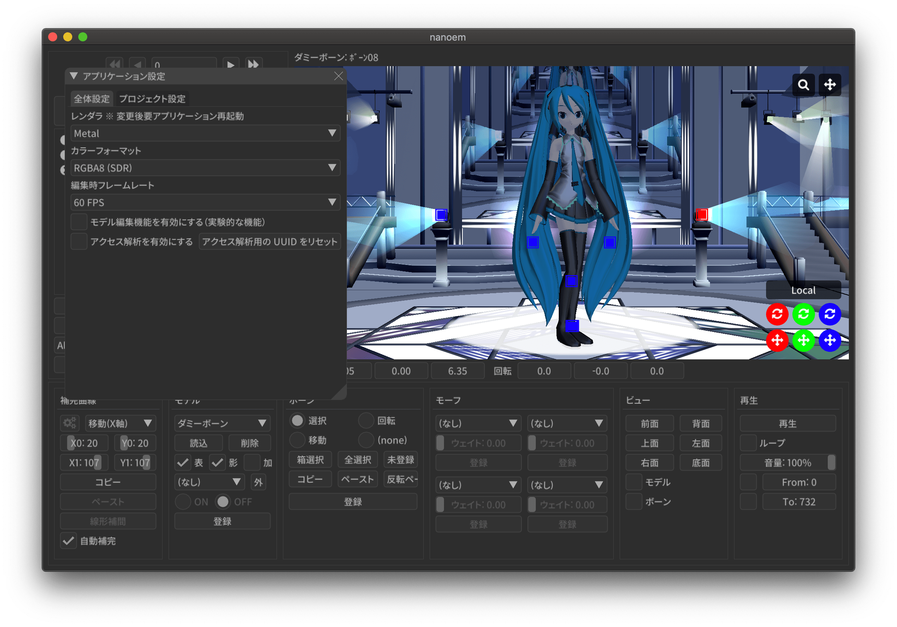
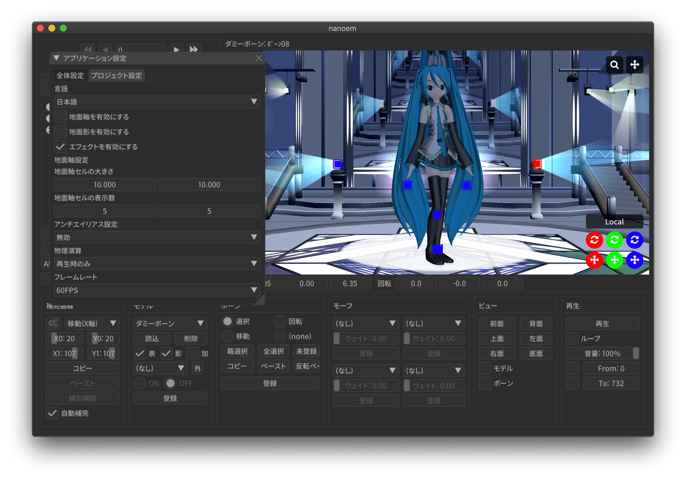

==========================================
アプリケーションの設定
==========================================

* macOS 版の場合はメニューから「nanoem」＞「設定」から開く
* Windows 版の場合はメニューから「編集」＞「設定」から開く

全体設定
******************************************

.. _9816D13E-ADA9-44D9-A869-1F61537D7753:

レンダラ
==========================================

.. important::
   macOS Mojavi 以降 OpenGL が非推奨に指定されたため、Metal が利用可能な場合は Metal を自動的に選択します

nanoem で使用するレンダラを変更します。OS によって利用可能なレンダラが異なります。

.. csv-table::

  **レンダラ**,**MacOS で利用可能？**,**Windows で利用可能？**
  OpenGL,⭕(Y),⭕(Y)
  Metal,⭕(Y),❌(N)
  DirectX11,❌(N),⭕(Y)

macOS 版の場合は利用可能なら Metal を、Windows 版は DirectX11 をデフォルトとして利用します。

カラーフォーマット
==========================================

ビューポート表示で使うフォーマットを表示します。デフォルトは RGBA8 です。

- RGBA8
- RGB10A2
- RGBA16F

RGB10A2 及び RGBA16F は HDR のため、正しく表示するには HDR に対応する外部液晶が必要です。
また、RGBA16F を選択すると RGBA8 よりも描画速度が遅くなります。

macOS 版かつ RGBA16F を選択したときのみ利用する色空間が Display P3 に変更されます。

編集時フレームレート
==========================================

.. note::
   プロジェクト再生時はメニューの「プロジェクト」の「フレームレート」が適用されます

プロジェクトを再生している時以外の FPS を選択します。

- 自動

  - 状況に応じて 30FPS または 60FPS を切り替えつつ処理します

    - 電源接続時はパフォーマンスを高めるため 60FPS で処理されます
    - バッテリー駆動の場合は消費を抑えるため 30FPS で処理されます

- 30FPS
- 60FPS
- 無制限

  - 垂直同期が無効になるので 60FPS を超えて最大出力で処理されます
  - 非常に重くなるので、どうしてもという時以外は使用しないこと

.. _2113320B-C307-4C28-819B-1614FC1103E4:

高解像度ビューポート
==========================================

.. note::
   この設定は高解像度液晶を採用しながら相対的に描画性能が厳しい外付け GPU がない Intel 版の MBA/MBP をターゲットとしています。
   ビューポートだけ描画が荒くなりますが、描画負荷を抑えることが可能になります（特にポストエフェクト利用で効果が大きく現れます）

高解像度ビューポートの設定方法を選択します。あくまで起動時の設定なので、「:ref:`88592664-60C0-40B8-B14A-06983999A95D`」で切り替えることが可能です。

- 起動時に自動設定

  - 起動時に外付け GPU が選択されている場合は有効に、それ以外の場合は無効にします
  - 初期設定は「起動時に自動設定」が適用されます

- 常に有効
- 常に無効

  - 29.0 未満は「常に有効」相当の処理が適用されていました

.. _F517A3B9-3273-4FE3-BD1E-4EDA53843140:

モデル編集機能を有効にする
==========================================

.. caution::
   当該機能は実験的な機能のため、今後仕様が変更される可能性があります

.. note::
   モデルプラグインの利用において「モデル編集機能を有効にする」は不要です

以下の機能を有効にして利用可能にします。

* :doc:`model`
* メニューにモデル編集機能関連の機能を追加

  * モデル (PMX形式 ) の書き出しも含まれる

初期値は無効です。

.. _D1BF8CFD-152D-4D1C-8B23-1FC6A4EBF391:

モデル表示の負荷分散を有効にする
==========================================

.. note::
   設定の反映はプロジェクトの新規作成または一回保存して読み込みする必要があります

モデル表示の際に CPU で演算される高負荷な処理であるスキニングを GPU に分散させます。有効にすると CPU 負荷が軽減されます。
ただし GPU によって演算結果が意図した結果にならずモデル表示が崩れることがあるため、その場合は無効にする必要があります。

負荷分散が有効になるのはあくまでモデルのスキニングのみなので、アクセサリやモデルの物理演算には適用されません。
また、以下の場合も「:ref:`D1BF8CFD-152D-4D1C-8B23-1FC6A4EBF391`」の状態に関係なくすべて CPU で演算します。

* ソフトボディがひとつ以上含まれたモデル利用時

  * 剛体がボーン単位であるのに対してソフトボディが頂点単位処理で競合するため高速化の恩恵を受けづらいためです
  * ソフトボディのみで構成されたモデルを分けて「:ref:`7A2F7651-1FF4-4669-861B-3A687D468E31`」を利用することである程度対処できます

* 「:doc:`model`」モード時

  * モード切替前に有効だった場合はモード終了時に無効から有効に戻します

初期値は無効です。

クラッシュレポートを有効にする
==========================================

.. note::
   設定の反映をするにはアプリケーションの再起動が必要です

クラッシュレポートを有効にします。クラッシュレポートは `Sentry <https://sentry.io>`_ を利用しています。

初期値は有効です。

アクセス解析を有効にする
==========================================

.. important::
   アクセス解析は 32.0 で廃止されたため現在は機能しません。

.. note::
   設定の反映をするにはアプリケーションの再起動が必要です

アクセス解析を有効にします。アクセス解析は `Google Analytics <https://analytics.google.com>`_ を利用しています。

初期値は有効です。

アクセス解析用の UUID をリセット
==========================================

.. note::
   処理の関係上設定の反映をするにはアプリケーションの再起動が必要です

アクセス解析用の UUID をリセットします。サポートから開発者より要請を受けた場合にのみ使用してください。

システム情報
==========================================

nanoem が動作している CPU 名、プラットフォーム名、ビルド情報をみることができます。

プロジェクト
******************************************

言語
==========================================

.. note::
   メニューを含め即座で変更が反映されるため、アプリケーションの再起動は不要です

UI で表示する言語を変更します。以下から選択可能です。

- 日本語
- 英語

デフォルトは OS の言語設定に依存します。OS の言語設定が日本語の場合は「日本語」が、それ以外の場合は「英語」が選ばれます。

地面軸を有効にする
==========================================

:ref:`02057C79-773C-4BE2-985C-FD2551914FA0` と同じです

地面影を有効にする
==========================================

:ref:`218DEFCD-1BB7-48FF-8A38-483361C2AE76` と同じです

エフェクトを有効にする
==========================================

:ref:`06ABE712-6592-4A14-9AEC-0DDEC4B4C9DC` と同じです

地面軸設定
==========================================

地面軸セルの大きさ
------------------------------------------

地面軸のセル（格子）の大きさを変更します。

地面軸セルの表示数
------------------------------------------

地面軸のセル（格子）の表示数を変更します。多ければ多いほど描画が重くなります。

アンチエイリアス設定
==========================================

:ref:`6D009308-F906-4BFB-B118-17DB0B526DA0` と同じです

物理演算
==========================================

:ref:`232F26BE-0B67-440E-9034-004AB625A402` と同じです

フレームレート
==========================================

:ref:`07C43859-06E8-4AAD-AA73-04414EC6A3FA` と同じです

.. _2F442197-62C2-468A-889A-E4FDF5D6E3F2:

保存時のファイルパス設定
==========================================

.. note::
   ファイルパスとは以下の種類の読み込まれたファイルのパスを指します。これらはプロジェクトファイルに中身を含めないためです。

   * モデル
   * アクセサリ
   * 材質割当したエフェクト

nmm 形式で保存する際のプロジェクト内に保存するファイルパスの設定の変更を行います。

初期値は相対パスですが、29.2.0 以前のバージョンでは絶対パスで保存されていた関係で
当該バージョンで保存されたプロジェクトを読み込むと絶対パスが初期値になります。

絶対パス
------------------------------------------

プロジェクトファイルの保存位置に依存しないファイルまでの完全なパスで保存します。

メリットはプロジェクトファイル自体を移動させた場合でも読み込むことができます。

デメリットとして例えばオンラインストレージなどで保存して別のマシンに同期後動かすと全く同じパスでないと読み込めなくなります。
また、読み込んだモデルやアクセサリを移動させると同じく読み込めなくなります。
さらに保存場所によりますが完全なパスを構築する関係でユーザ名のフォルダ名が含まれることが多く個人情報が見えてしまうためファイルの受け渡しに向いていません。

相対パス
------------------------------------------

.. caution::
   相対パスで設定しても相対パスが解決出来なかった場合は絶対パスで保存されます。
   これは Windows においてプロジェクトの保存先と異なるドライブで読み込まれた場合に該当します。

プロジェクトファイルの保存位置からファイルまでの相対的なパスで保存します。

メリットは例えばオンラインストレージなどで保存して同期した後に別のマシンで動かすことが可能になります。

デメリットとしてプロジェクトファイル自体を移動させた場合は読み込んだモデルやアクセサリも全て同時に移動させる必要がある点です。
また、読み込んだモデルやアクセサリを移動させると同じく読み込めなくなります。
